# GitHub Trending Report (2026-04-10)

- Source: `https://github.com/trending?since=daily|weekly|monthly`
- Method: 抓 Trending 卡片 + 仓库主页 + README 标题/前几段，生成中英对照解读。
- Scope: 每个周期抓取前 10 个可见项目，详细讲解保留前 5 个。

## Overview

- 每日: 10 repos, top repo is `NousResearch/hermes-agent`
- 每周: 10 repos, top repo is `google-ai-edge/gallery`
- 每月: 10 repos, top repo is `NousResearch/hermes-agent`

## 每日 Trending

| Rank | Repo | Lang | Stars | Forks | Trend | Description |
| --- | --- | --- | --- | --- | --- | --- |
| 1 | [NousResearch/hermes-agent](https://github.com/NousResearch/hermes-agent) | Python | 46,887 | 6,029 | 6,485 | The agent that grows with you |
| 2 | [forrestchang/andrej-karpathy-skills](https://github.com/forrestchang/andrej-karpathy-skills) | - | 10,878 | 724 | 1,364 | A single CLAUDE.md file to improve Claude Code behavior, derived from Andrej Karpathy's observations on LLM coding pitfalls. |
| 3 | [HKUDS/DeepTutor](https://github.com/HKUDS/DeepTutor) | Python | 15,246 | 2,026 | 1,310 | "DeepTutor: Agent-Native Personalized Learning Assistant" |
| 4 | [OpenBMB/VoxCPM](https://github.com/OpenBMB/VoxCPM) | Python | 7,937 | 931 | 496 | VoxCPM2: Tokenizer-Free TTS for Multilingual Speech Generation, Creative Voice Design, and True-to-Life Cloning |
| 5 | [opendataloader-project/opendataloader-pdf](https://github.com/opendataloader-project/opendataloader-pdf) | Java | 14,124 | 1,188 | 1,124 | PDF Parser for AI-ready data. Automate PDF accessibility. Open-source. |
| 6 | [obra/superpowers](https://github.com/obra/superpowers) | Shell | 144,274 | 12,345 | 2,299 | An agentic skills framework & software development methodology that works. |
| 7 | [TheCraigHewitt/seomachine](https://github.com/TheCraigHewitt/seomachine) | Python | 5,326 | 765 | 725 | A specialized Claude Code workspace for creating long-form, SEO-optimized blog content for any business. This system helps you research, write, analyze, and optimize content that ranks well and serves your target audience. |
| 8 | [coleam00/Archon](https://github.com/coleam00/Archon) | TypeScript | 14,584 | 2,479 | 185 | The first open-source harness builder for AI coding. Make AI coding deterministic and repeatable. |
| 9 | [shiyu-coder/Kronos](https://github.com/shiyu-coder/Kronos) | Python | 12,344 | 2,517 | 245 | Kronos: A Foundation Model for the Language of Financial Markets |
| 10 | [YishenTu/claudian](https://github.com/YishenTu/claudian) | TypeScript | 6,999 | 409 | 200 | An Obsidian plugin that embeds Claude Code as an AI collaborator in your vault |

### Detailed Notes (5 repos)

### 1. NousResearch/hermes-agent

- Repository: [NousResearch/hermes-agent](https://github.com/NousResearch/hermes-agent)
- Period: 每日
- Language: Python
- Stars / Forks: 46,887 / 6,029
- Trending Increment: 6,485
- Topics: ai, openai, hermes, codex, ai-agents, claude, ai-agent, llm
- README Headings: Hermes Agent ☤, Quick Install, Getting Started, CLI vs Messaging Quick Reference, Documentation, Migrating from OpenClaw
- Mermaid In README: 0
- Workflow Hints: Quick Install, Getting Started

#### README Summary

- The self-improving AI agent built by Nous Research . It's the only agent with a built-in learning loop — it creates skills from experience, improves them during use, nudges itself to persist knowledge, searches its own past conversations, and builds a deepe...
- Use any model you want — Nous Portal , OpenRouter (200+ models), z.ai/GLM , Kimi/Moonshot , MiniMax , OpenAI, or your own endpoint. Switch with hermes model — no code changes, no lock-in.
- Works on Linux, macOS, WSL2, and Android via Termux. The installer handles the platform-specific setup for you.

#### 中文讲解

这是一个偏向 AI 智能体/开发者工具 的仓库。结合 Trending 简介和 README 开头内容看，它主要围绕 快速上手、命令行体验、自动化与智能体 展开，目标用户是 需要自动化编码或多端协同的开发者。如果你想快速判断是否值得跟进，可以先看仓库开头强调的这条信号：The self-improving AI agent built by Nous Research . It's the only agent with a built-in learning loop — it creates skills from experienc...

#### English Explanation

This repository is best understood as an AI agent and developer tool. Based on the trending card and README opening, it mainly focuses on quick onboarding, CLI experience, automation and agent behaviors, and it is aimed at developers who need coding automation or multi-channel workflows. A good early signal to judge fit is this opening emphasis: The self-improving AI agent built by Nous Research . It's the only agent with a built-in learning loop — it creates skills from experienc...

#### Mermaid / Workflow

> 下面是基于 README 标题整理的示意图，不是仓库原图。

### 2. forrestchang/andrej-karpathy-skills

- Repository: [forrestchang/andrej-karpathy-skills](https://github.com/forrestchang/andrej-karpathy-skills)
- Period: 每日
- Language: -
- Stars / Forks: 10,878 / 724
- Trending Increment: 1,364
- Topics: 未抓到 topic
- README Headings: Karpathy-Inspired Claude Code Guidelines, The Problems, The Solution, The Four Principles in Detail, 1. Think Before Coding, 2. Simplicity First
- Mermaid In README: 0
- Workflow Hints: 未发现明显的 workflow / architecture 标题

#### README Summary

- A single CLAUDE.md file to improve Claude Code behavior, derived from Andrej Karpathy's observations on LLM coding pitfalls.
- "The models make wrong assumptions on your behalf and just run along with them without checking. They don't manage their confusion, don't seek clarifications, don't surface inconsistencies, don't present tradeoffs, don't push back when they should."
- "They really like to overcomplicate code and APIs, bloat abstractions, don't clean up dead code... implement a bloated construction over 1000 lines when 100 would do."

#### 中文讲解

这是一个偏向 AI 智能体/开发者工具 的仓库。结合 Trending 简介和 README 开头内容看，它主要围绕 README 中强调的核心能力 展开，目标用户是 需要自动化编码或多端协同的开发者。如果你想快速判断是否值得跟进，可以先看仓库开头强调的这条信号：A single CLAUDE.md file to improve Claude Code behavior, derived from Andrej Karpathy's observations on LLM coding pitfalls.

#### English Explanation

This repository is best understood as an AI agent and developer tool. Based on the trending card and README opening, it mainly focuses on the key capabilities highlighted in the README, and it is aimed at developers who need coding automation or multi-channel workflows. A good early signal to judge fit is this opening emphasis: A single CLAUDE.md file to improve Claude Code behavior, derived from Andrej Karpathy's observations on LLM coding pitfalls.

### 3. HKUDS/DeepTutor

- Repository: [HKUDS/DeepTutor](https://github.com/HKUDS/DeepTutor)
- Period: 每日
- Language: Python
- Stars / Forks: 15,246 / 2,026
- Trending Increment: 1,310
- Topics: interactive-learning, multi-agent-systems, ai-agents, cli-tool, rag, large-language-models, ai-tutor, deepresearch
- README Headings: DeepTutor: Agent-Native Personalized Tutoring, 📰 News, 📦 Releases, ✨ Key Features, 🚀 Get Started, Option A — Setup Tour (Recommended)
- Mermaid In README: 0
- Workflow Hints: [2026.4.4] Long time no see! ✨ DeepTutor v1.0.0 is finally here — an agent-native evolution featuring a ground-up architecture rewrite, TutorBot, and flexible mode switching under the Apache-2.0 license. A new chapter begins, and our story continues!

#### README Summary

- Features · Get Started · Explore · TutorBot · CLI · Community
- 🇨🇳 中文 · 🇯🇵 日本語 · 🇪🇸 Español · 🇫🇷 Français · 🇸🇦 العربية · 🇷🇺 Русский · 🇮🇳 हिन्दी · 🇵🇹 Português
- [2026.4.4] Long time no see! ✨ DeepTutor v1.0.0 is finally here — an agent-native evolution featuring a ground-up architecture rewrite, TutorBot, and flexible mode switching under the Apache-2.0 license. A new chapter begins, and our story continues!

#### 中文讲解

这是一个偏向 AI 智能体/开发者工具 的仓库。结合 Trending 简介和 README 开头内容看，它主要围绕 核心能力、命令行体验、自动化与智能体 展开，目标用户是 需要自动化编码或多端协同的开发者。如果你想快速判断是否值得跟进，可以先看仓库开头强调的这条信号：Features · Get Started · Explore · TutorBot · CLI · Community

#### English Explanation

This repository is best understood as an AI agent and developer tool. Based on the trending card and README opening, it mainly focuses on core capabilities, CLI experience, automation and agent behaviors, and it is aimed at developers who need coding automation or multi-channel workflows. A good early signal to judge fit is this opening emphasis: Features · Get Started · Explore · TutorBot · CLI · Community

#### Mermaid / Workflow

> 下面是基于 README 标题整理的示意图，不是仓库原图。

```mermaid
%%{init: {
  "theme": "base",
  "themeVariables": {
    "fontFamily": "\"Press Start 2P\", \"Courier New\", monospace",
    "primaryColor": "#F7D354",
    "primaryTextColor": "#1A1A1A",
    "primaryBorderColor": "#1A1A1A",
    "secondaryColor": "#63D1F4",
    "secondaryTextColor": "#1A1A1A",
    "secondaryBorderColor": "#1A1A1A",
    "tertiaryColor": "#FF7A90",
    "tertiaryTextColor": "#1A1A1A",
    "tertiaryBorderColor": "#1A1A1A",
    "lineColor": "#1A1A1A",
    "mainBkg": "#F4EBD0",
    "clusterBkg": "#F4EBD0",
    "clusterBorder": "#1A1A1A",
    "edgeLabelBackground": "#F4EBD0",
    "nodeBorder": "#1A1A1A"
  },
  "flowchart": {
    "curve": "linear",
    "htmlLabels": false
  }
}}%%
flowchart LR
user["Trending Reader"] --> repo["HKUDS/DeepTutor"]
classDef punch fill:#F7D354,stroke:#1A1A1A,stroke-width:4px,color:#1A1A1A,font-family:'Courier New',monospace;
classDef pop fill:#63D1F4,stroke:#1A1A1A,stroke-width:4px,color:#1A1A1A,font-family:'Courier New',monospace;
classDef spark fill:#FF7A90,stroke:#1A1A1A,stroke-width:4px,color:#1A1A1A,font-family:'Courier New',monospace;
classDef soft fill:#8EEB7A,stroke:#1A1A1A,stroke-width:4px,color:#1A1A1A,font-family:'Courier New',monospace;
repo --> keyfeatures["✨ Key Features"]
class keyfeatures spark;
class user,repo punch;
```

### 4. OpenBMB/VoxCPM

- Repository: [OpenBMB/VoxCPM](https://github.com/OpenBMB/VoxCPM)
- Period: 每日
- Language: Python
- Stars / Forks: 7,937 / 931
- Trending Increment: 496
- Topics: audio, multilingual, python, text-to-speech, speech, pytorch, tts, speech-synthesis
- README Headings: VoxCPM2: Tokenizer-Free TTS for Multilingual Speech Generation, Creative Voice Design, and True-to-Life Cloning, ✨ Highlights, News, Contents, 🚀 Quick Start, Installation
- Mermaid In README: 0
- Workflow Hints: 🚀 Quick Start, VoxCPM is a tokenizer-free Text-to-Speech system that directly generates continuous speech representations via an end-to-end diffusion autoregressive architecture , bypassing discrete tokenization to achieve highly natural and expressive synthesis.

#### README Summary

- 👋 Join our community for discussion and support! Feishu | Discord
- VoxCPM is a tokenizer-free Text-to-Speech system that directly generates continuous speech representations via an end-to-end diffusion autoregressive architecture , bypassing discrete tokenization to achieve highly natural and expressive synthesis.
- VoxCPM2 is the latest major release — a 2B parameter model trained on over 2 million hours of multilingual speech data, now supporting 30 languages , Voice Design , Controllable Voice Cloning , and 48kHz studio-quality audio output. Built on a MiniCPM-4 bac...

#### 中文讲解

这是一个偏向 演示内容创作工具 的仓库。结合 Trending 简介和 README 开头内容看，它主要围绕 快速上手、核心能力 展开，目标用户是 关注该方向的开源使用者。如果你想快速判断是否值得跟进，可以先看仓库开头强调的这条信号：👋 Join our community for discussion and support! Feishu | Discord

#### English Explanation

This repository is best understood as an demo and content creation tool. Based on the trending card and README opening, it mainly focuses on quick onboarding, core capabilities, and it is aimed at open-source users exploring this space. A good early signal to judge fit is this opening emphasis: 👋 Join our community for discussion and support! Feishu | Discord

#### Mermaid / Workflow

> 下面是基于 README 标题整理的示意图，不是仓库原图。

### 5. opendataloader-project/opendataloader-pdf

- Repository: [opendataloader-project/opendataloader-pdf](https://github.com/opendataloader-project/opendataloader-pdf)
- Period: 每日
- Language: Java
- Stars / Forks: 14,124 / 1,188
- Trending Increment: 1,124
- Topics: html, markdown, pdf, json, ocr, ai, accessibility, a11y
- README Headings: OpenDataLoader PDF, Get Started in 30 Seconds, What Problems Does This Solve?, Capability Matrix, Extraction Benchmarks, Which Mode Should I Use?
- Mermaid In README: 0
- Workflow Hints: 未发现明显的 workflow / architecture 标题

#### README Summary

- PDF Parser for AI-ready data. Automate PDF accessibility. Open-source.
- 🔍 PDF parser for AI data extraction — Extract Markdown, JSON (with bounding boxes), and HTML from any PDF. #1 in benchmarks (0.907 overall). Deterministic local mode + AI hybrid mode for complex pages.
- How accurate is it? — #1 in benchmarks: 0.907 overall, 0.928 table accuracy across 200 real-world PDFs including multi-column and scientific papers. Deterministic local mode + AI hybrid mode for complex pages ( benchmarks )

#### 中文讲解

这是一个偏向 开源项目 的仓库。结合 Trending 简介和 README 开头内容看，它主要围绕 核心能力 展开，目标用户是 关注该方向的开源使用者。如果你想快速判断是否值得跟进，可以先看仓库开头强调的这条信号：PDF Parser for AI-ready data. Automate PDF accessibility. Open-source.

#### English Explanation

This repository is best understood as an open-source project. Based on the trending card and README opening, it mainly focuses on core capabilities, and it is aimed at open-source users exploring this space. A good early signal to judge fit is this opening emphasis: PDF Parser for AI-ready data. Automate PDF accessibility. Open-source.

#### Mermaid / Workflow

> 下面是基于 README 标题整理的示意图，不是仓库原图。

```mermaid
%%{init: {
  "theme": "base",
  "themeVariables": {
    "fontFamily": "\"Press Start 2P\", \"Courier New\", monospace",
    "primaryColor": "#F7D354",
    "primaryTextColor": "#1A1A1A",
    "primaryBorderColor": "#1A1A1A",
    "secondaryColor": "#63D1F4",
    "secondaryTextColor": "#1A1A1A",
    "secondaryBorderColor": "#1A1A1A",
    "tertiaryColor": "#FF7A90",
    "tertiaryTextColor": "#1A1A1A",
    "tertiaryBorderColor": "#1A1A1A",
    "lineColor": "#1A1A1A",
    "mainBkg": "#F4EBD0",
    "clusterBkg": "#F4EBD0",
    "clusterBorder": "#1A1A1A",
    "edgeLabelBackground": "#F4EBD0",
    "nodeBorder": "#1A1A1A"
  },
  "flowchart": {
    "curve": "linear",
    "htmlLabels": false
  }
}}%%
flowchart LR
user["Trending Reader"] --> repo["opendataloader-project/op..."]
classDef punch fill:#F7D354,stroke:#1A1A1A,stroke-width:4px,color:#1A1A1A,font-family:'Courier New',monospace;
classDef pop fill:#63D1F4,stroke:#1A1A1A,stroke-width:4px,color:#1A1A1A,font-family:'Courier New',monospace;
classDef spark fill:#FF7A90,stroke:#1A1A1A,stroke-width:4px,color:#1A1A1A,font-family:'Courier New',monospace;
classDef soft fill:#8EEB7A,stroke:#1A1A1A,stroke-width:4px,color:#1A1A1A,font-family:'Courier New',monospace;
repo --> html["html"]
class html spark;
html --> markdown["markdown"]
class markdown pop;
markdown --> pdf["pdf"]
class pdf soft;
class user,repo punch;
```

## 每周 Trending

| Rank | Repo | Lang | Stars | Forks | Trend | Description |
| --- | --- | --- | --- | --- | --- | --- |
| 1 | [google-ai-edge/gallery](https://github.com/google-ai-edge/gallery) | Kotlin | 19,995 | 1,865 | 4,326 | A gallery that showcases on-device ML/GenAI use cases and allows people to try and use models locally. |
| 2 | [Yeachan-Heo/oh-my-codex](https://github.com/Yeachan-Heo/oh-my-codex) | TypeScript | 20,130 | 1,819 | 9,737 | OmX - Oh My codeX: Your codex is not alone. Add hooks, agent teams, HUDs, and so much more. |
| 3 | [siddharthvaddem/openscreen](https://github.com/siddharthvaddem/openscreen) | TypeScript | 27,142 | 1,811 | 12,278 | Create stunning demos for free. Open-source, no subscriptions, no watermarks, and free for commercial use. An alternative to Screen Studio. |
| 4 | [NousResearch/hermes-agent](https://github.com/NousResearch/hermes-agent) | Python | 46,887 | 6,029 | 6,485 | The agent that grows with you |
| 5 | [google-ai-edge/LiteRT-LM](https://github.com/google-ai-edge/LiteRT-LM) | C++ | 3,226 | 301 | 2,157 | - |
| 6 | [HKUDS/DeepTutor](https://github.com/HKUDS/DeepTutor) | Python | 15,246 | 2,026 | 1,310 | "DeepTutor: Agent-Native Personalized Learning Assistant" |
| 7 | [onyx-dot-app/onyx](https://github.com/onyx-dot-app/onyx) | Python | 26,259 | 3,499 | 5,556 | Open Source AI Platform - AI Chat with advanced features that works with every LLM |
| 8 | [google-research/timesfm](https://github.com/google-research/timesfm) | Python | 16,053 | 1,461 | 3,095 | TimesFM (Time Series Foundation Model) is a pretrained time-series foundation model developed by Google Research for time-series forecasting. |
| 9 | [NVIDIA/personaplex](https://github.com/NVIDIA/personaplex) | Python | 8,805 | 1,243 | 2,745 | PersonaPlex code. |
| 10 | [luongnv89/claude-howto](https://github.com/luongnv89/claude-howto) | Python | 24,229 | 2,904 | 7,342 | A visual, example-driven guide to Claude Code — from basic concepts to advanced agents, with copy-paste templates that bring immediate value. |

### Detailed Notes (5 repos)

### 1. google-ai-edge/gallery

- Repository: [google-ai-edge/gallery](https://github.com/google-ai-edge/gallery)
- Period: 每周
- Language: Kotlin
- Stars / Forks: 19,995 / 1,865
- Trending Increment: 4,326
- Topics: 未抓到 topic
- README Headings: Google AI Edge Gallery ✨, App Preview, ✨ Core Features, 🏁 Get Started in Minutes!, 🛠️ Technology Highlights, ⌨️ Development
- Mermaid In README: 0
- Workflow Hints: ✨ Core Features, 🛠️ Technology Highlights

#### README Summary

- Explore, Experience, and Evaluate the Future of On-Device Generative AI with Google AI Edge.
- AI Edge Gallery is the premier destination for running the world's most powerful open-source Large Language Models (LLMs) on your mobile device. Experience high-performance Generative AI directly on your hardware—fully offline, private, and lightning-fast.
- The latest version brings official support for the newly released Gemma 4 family. As the centerpiece of this release, Gemma 4 allows you to test the cutting edge of on-device AI. Experience advanced reasoning, logic, and creative capabilities without ever s...

#### 中文讲解

这是一个偏向 AI 智能体/开发者工具 的仓库。结合 Trending 简介和 README 开头内容看，它主要围绕 核心能力、端侧应用、模型与推理 展开，目标用户是 想快速试用能力和参考样例的开发者/产品团队。如果你想快速判断是否值得跟进，可以先看仓库开头强调的这条信号：Explore, Experience, and Evaluate the Future of On-Device Generative AI with Google AI Edge.

#### English Explanation

This repository is best understood as an AI agent and developer tool. Based on the trending card and README opening, it mainly focuses on core capabilities, on-device or app usage, models and inference, and it is aimed at developers or product teams who want quick hands-on examples. A good early signal to judge fit is this opening emphasis: Explore, Experience, and Evaluate the Future of On-Device Generative AI with Google AI Edge.

#### Mermaid / Workflow

> 下面是基于 README 标题整理的示意图，不是仓库原图。

### 2. Yeachan-Heo/oh-my-codex

- Repository: [Yeachan-Heo/oh-my-codex](https://github.com/Yeachan-Heo/oh-my-codex)
- Period: 每周
- Language: TypeScript
- Stars / Forks: 20,130 / 1,819
- Trending Increment: 9,737
- Topics: 未抓到 topic
- README Headings: oh-my-codex (OMX), Core Maintainers, Ambassadors, Top Collaborators, Recommended default flow, What OMX is for
- Mermaid In README: 0
- Workflow Hints: Recommended default flow, Start Codex stronger, then let OMX add better prompts, workflows, and runtime help when the work grows., Website: https://yeachan-heo.github.io/oh-my-codex-website/ Docs: Getting Started · Agents · Skills · Integrations · Demo · OpenClaw guide Community: Discord — shared OMX/community server for oh-my-codex and related tooling., OMX is a workflow layer for OpenAI Codex CLI .

#### README Summary

- Start Codex stronger, then let OMX add better prompts, workflows, and runtime help when the work grows.
- Website: https://yeachan-heo.github.io/oh-my-codex-website/ Docs: Getting Started · Agents · Skills · Integrations · Demo · OpenClaw guide Community: Discord — shared OMX/community server for oh-my-codex and related tooling.
- OMX is a workflow layer for OpenAI Codex CLI .

#### 中文讲解

这是一个偏向 AI 智能体/开发者工具 的仓库。结合 Trending 简介和 README 开头内容看，它主要围绕 工作流/架构、自动化与智能体 展开，目标用户是 需要自动化编码或多端协同的开发者。如果你想快速判断是否值得跟进，可以先看仓库开头强调的这条信号：Start Codex stronger, then let OMX add better prompts, workflows, and runtime help when the work grows.

#### English Explanation

This repository is best understood as an AI agent and developer tool. Based on the trending card and README opening, it mainly focuses on workflow and architecture, automation and agent behaviors, and it is aimed at developers who need coding automation or multi-channel workflows. A good early signal to judge fit is this opening emphasis: Start Codex stronger, then let OMX add better prompts, workflows, and runtime help when the work grows.

#### Mermaid / Workflow

> 下面是基于 README 标题整理的示意图，不是仓库原图。

### 3. siddharthvaddem/openscreen

- Repository: [siddharthvaddem/openscreen](https://github.com/siddharthvaddem/openscreen)
- Period: 每周
- Language: TypeScript
- Stars / Forks: 27,142 / 1,811
- Trending Increment: 12,278
- Topics: electron, open-source, screen-recorder, screen-capture, pixijs
- README Headings: OpenScreen, Core Features, Installation, macOS, Linux, Limitations
- Mermaid In README: 0
- Workflow Hints: Core Features

#### README Summary

- This is very much in beta and might be buggy here and there (but hope you have a good experience!).
- OpenScreen is your free, open-source alternative to Screen Studio (sort of).
- If you don't want to pay $29/month for Screen Studio but want a much simpler version that does what most people seem to need, making beautiful product demos and walkthroughs, here's a free-to-use app for you. OpenScreen does not offer all Screen Studio feat...

#### 中文讲解

这是一个偏向 演示内容创作工具 的仓库。结合 Trending 简介和 README 开头内容看，它主要围绕 快速上手、核心能力 展开，目标用户是 要制作演示视频或产品展示内容的创作者。如果你想快速判断是否值得跟进，可以先看仓库开头强调的这条信号：This is very much in beta and might be buggy here and there (but hope you have a good experience!).

#### English Explanation

This repository is best understood as an demo and content creation tool. Based on the trending card and README opening, it mainly focuses on quick onboarding, core capabilities, and it is aimed at creators making product demos or presentation content. A good early signal to judge fit is this opening emphasis: This is very much in beta and might be buggy here and there (but hope you have a good experience!).

#### Mermaid / Workflow

> 下面是基于 README 标题整理的示意图，不是仓库原图。

### 4. NousResearch/hermes-agent

- Repository: [NousResearch/hermes-agent](https://github.com/NousResearch/hermes-agent)
- Period: 每周
- Language: Python
- Stars / Forks: 46,887 / 6,029
- Trending Increment: 6,485
- Topics: ai, openai, hermes, codex, ai-agents, claude, ai-agent, llm
- README Headings: Hermes Agent ☤, Quick Install, Getting Started, CLI vs Messaging Quick Reference, Documentation, Migrating from OpenClaw
- Mermaid In README: 0
- Workflow Hints: Quick Install, Getting Started

#### README Summary

- The self-improving AI agent built by Nous Research . It's the only agent with a built-in learning loop — it creates skills from experience, improves them during use, nudges itself to persist knowledge, searches its own past conversations, and builds a deepe...
- Use any model you want — Nous Portal , OpenRouter (200+ models), z.ai/GLM , Kimi/Moonshot , MiniMax , OpenAI, or your own endpoint. Switch with hermes model — no code changes, no lock-in.
- Works on Linux, macOS, WSL2, and Android via Termux. The installer handles the platform-specific setup for you.

#### 中文讲解

这是一个偏向 AI 智能体/开发者工具 的仓库。结合 Trending 简介和 README 开头内容看，它主要围绕 快速上手、命令行体验、自动化与智能体 展开，目标用户是 需要自动化编码或多端协同的开发者。如果你想快速判断是否值得跟进，可以先看仓库开头强调的这条信号：The self-improving AI agent built by Nous Research . It's the only agent with a built-in learning loop — it creates skills from experienc...

#### English Explanation

This repository is best understood as an AI agent and developer tool. Based on the trending card and README opening, it mainly focuses on quick onboarding, CLI experience, automation and agent behaviors, and it is aimed at developers who need coding automation or multi-channel workflows. A good early signal to judge fit is this opening emphasis: The self-improving AI agent built by Nous Research . It's the only agent with a built-in learning loop — it creates skills from experienc...

#### Mermaid / Workflow

> 下面是基于 README 标题整理的示意图，不是仓库原图。

### 5. google-ai-edge/LiteRT-LM

- Repository: [google-ai-edge/LiteRT-LM](https://github.com/google-ai-edge/LiteRT-LM)
- Period: 每周
- Language: C++
- Stars / Forks: 3,226 / 301
- Trending Increment: 2,157
- Topics: 未抓到 topic
- README Headings: LiteRT-LM, 🔥 What's New: Gemma 4 support with LiteRT-LM, 🌟 Key Features, 🚀 Production-Ready for Google's Products, 📰 Blogs & Announcements, 🏃 Quick Start
- Mermaid In README: 0
- Workflow Hints: 🏃 Quick Start

#### README Summary

- LiteRT-LM is Google's production-ready, high-performance, open-source inference framework for deploying Large Language Models on edge devices.
- Deploy Gemma 4 across a broad range of hardware with stellar performance ( blog ).
- 👉 Try on Linux, macOS, Windows (WSL) or Raspberry Pi with the LiteRT-LM CLI :

#### 中文讲解

这是一个偏向 底层库/运行时项目 的仓库。结合 Trending 简介和 README 开头内容看，它主要围绕 快速上手、核心能力 展开，目标用户是 关注该方向的开源使用者。如果你想快速判断是否值得跟进，可以先看仓库开头强调的这条信号：LiteRT-LM is Google's production-ready, high-performance, open-source inference framework for deploying Large Language Models on edge dev...

#### English Explanation

This repository is best understood as an core library or runtime project. Based on the trending card and README opening, it mainly focuses on quick onboarding, core capabilities, and it is aimed at open-source users exploring this space. A good early signal to judge fit is this opening emphasis: LiteRT-LM is Google's production-ready, high-performance, open-source inference framework for deploying Large Language Models on edge dev...

#### Mermaid / Workflow

> 下面是基于 README 标题整理的示意图，不是仓库原图。

## 每月 Trending

| Rank | Repo | Lang | Stars | Forks | Trend | Description |
| --- | --- | --- | --- | --- | --- | --- |
| 1 | [NousResearch/hermes-agent](https://github.com/NousResearch/hermes-agent) | Python | 46,887 | 6,029 | 6,485 | The agent that grows with you |
| 2 | [Yeachan-Heo/oh-my-codex](https://github.com/Yeachan-Heo/oh-my-codex) | TypeScript | 20,130 | 1,819 | 9,737 | OmX - Oh My codeX: Your codex is not alone. Add hooks, agent teams, HUDs, and so much more. |
| 3 | [mattpocock/skills](https://github.com/mattpocock/skills) | Shell | 13,602 | 1,122 | 12,380 | My personal directory of skills, straight from my .claude directory. |
| 4 | [666ghj/MiroFish](https://github.com/666ghj/MiroFish) | Python | 52,862 | 7,885 | 44,278 | A Simple and Universal Swarm Intelligence Engine, Predicting Anything. 简洁通用的群体智能引擎，预测万物 |
| 5 | [bytedance/deer-flow](https://github.com/bytedance/deer-flow) | Python | 60,048 | 7,623 | 33,722 | An open-source long-horizon SuperAgent harness that researches, codes, and creates. With the help of sandboxes, memories, tools, skill, subagents and message gateway, it handles different levels of tasks that could take minutes to hours. |
| 6 | [FujiwaraChoki/MoneyPrinterV2](https://github.com/FujiwaraChoki/MoneyPrinterV2) | Python | 29,030 | 3,132 | 14,209 | Automate the process of making money online. |
| 7 | [lightpanda-io/browser](https://github.com/lightpanda-io/browser) | Zig | 28,083 | 1,179 | 16,038 | Lightpanda: the headless browser designed for AI and automation |
| 8 | [msitarzewski/agency-agents](https://github.com/msitarzewski/agency-agents) | Shell | 77,240 | 12,209 | 61,564 | A complete AI agency at your fingertips - From frontend wizards to Reddit community ninjas, from whimsy injectors to reality checkers. Each agent is a specialized expert with personality, processes, and proven deliverables. |
| 9 | [siddharthvaddem/openscreen](https://github.com/siddharthvaddem/openscreen) | TypeScript | 27,142 | 1,811 | 12,278 | Create stunning demos for free. Open-source, no subscriptions, no watermarks, and free for commercial use. An alternative to Screen Studio. |
| 10 | [affaan-m/everything-claude-code](https://github.com/affaan-m/everything-claude-code) | JavaScript | 149,093 | 23,064 | 80,680 | The agent harness performance optimization system. Skills, instincts, memory, security, and research-first development for Claude Code, Codex, Opencode, Cursor and beyond. |

### Detailed Notes (5 repos)

### 1. NousResearch/hermes-agent

- Repository: [NousResearch/hermes-agent](https://github.com/NousResearch/hermes-agent)
- Period: 每月
- Language: Python
- Stars / Forks: 46,887 / 6,029
- Trending Increment: 6,485
- Topics: ai, openai, hermes, codex, ai-agents, claude, ai-agent, llm
- README Headings: Hermes Agent ☤, Quick Install, Getting Started, CLI vs Messaging Quick Reference, Documentation, Migrating from OpenClaw
- Mermaid In README: 0
- Workflow Hints: Quick Install, Getting Started

#### README Summary

- The self-improving AI agent built by Nous Research . It's the only agent with a built-in learning loop — it creates skills from experience, improves them during use, nudges itself to persist knowledge, searches its own past conversations, and builds a deepe...
- Use any model you want — Nous Portal , OpenRouter (200+ models), z.ai/GLM , Kimi/Moonshot , MiniMax , OpenAI, or your own endpoint. Switch with hermes model — no code changes, no lock-in.
- Works on Linux, macOS, WSL2, and Android via Termux. The installer handles the platform-specific setup for you.

#### 中文讲解

这是一个偏向 AI 智能体/开发者工具 的仓库。结合 Trending 简介和 README 开头内容看，它主要围绕 快速上手、命令行体验、自动化与智能体 展开，目标用户是 需要自动化编码或多端协同的开发者。如果你想快速判断是否值得跟进，可以先看仓库开头强调的这条信号：The self-improving AI agent built by Nous Research . It's the only agent with a built-in learning loop — it creates skills from experienc...

#### English Explanation

This repository is best understood as an AI agent and developer tool. Based on the trending card and README opening, it mainly focuses on quick onboarding, CLI experience, automation and agent behaviors, and it is aimed at developers who need coding automation or multi-channel workflows. A good early signal to judge fit is this opening emphasis: The self-improving AI agent built by Nous Research . It's the only agent with a built-in learning loop — it creates skills from experienc...

#### Mermaid / Workflow

> 下面是基于 README 标题整理的示意图，不是仓库原图。

### 2. Yeachan-Heo/oh-my-codex

- Repository: [Yeachan-Heo/oh-my-codex](https://github.com/Yeachan-Heo/oh-my-codex)
- Period: 每月
- Language: TypeScript
- Stars / Forks: 20,130 / 1,819
- Trending Increment: 9,737
- Topics: 未抓到 topic
- README Headings: oh-my-codex (OMX), Core Maintainers, Ambassadors, Top Collaborators, Recommended default flow, What OMX is for
- Mermaid In README: 0
- Workflow Hints: Recommended default flow, Start Codex stronger, then let OMX add better prompts, workflows, and runtime help when the work grows., Website: https://yeachan-heo.github.io/oh-my-codex-website/ Docs: Getting Started · Agents · Skills · Integrations · Demo · OpenClaw guide Community: Discord — shared OMX/community server for oh-my-codex and related tooling., OMX is a workflow layer for OpenAI Codex CLI .

#### README Summary

- Start Codex stronger, then let OMX add better prompts, workflows, and runtime help when the work grows.
- Website: https://yeachan-heo.github.io/oh-my-codex-website/ Docs: Getting Started · Agents · Skills · Integrations · Demo · OpenClaw guide Community: Discord — shared OMX/community server for oh-my-codex and related tooling.
- OMX is a workflow layer for OpenAI Codex CLI .

#### 中文讲解

这是一个偏向 AI 智能体/开发者工具 的仓库。结合 Trending 简介和 README 开头内容看，它主要围绕 工作流/架构、自动化与智能体 展开，目标用户是 需要自动化编码或多端协同的开发者。如果你想快速判断是否值得跟进，可以先看仓库开头强调的这条信号：Start Codex stronger, then let OMX add better prompts, workflows, and runtime help when the work grows.

#### English Explanation

This repository is best understood as an AI agent and developer tool. Based on the trending card and README opening, it mainly focuses on workflow and architecture, automation and agent behaviors, and it is aimed at developers who need coding automation or multi-channel workflows. A good early signal to judge fit is this opening emphasis: Start Codex stronger, then let OMX add better prompts, workflows, and runtime help when the work grows.

#### Mermaid / Workflow

> 下面是基于 README 标题整理的示意图，不是仓库原图。

### 3. mattpocock/skills

- Repository: [mattpocock/skills](https://github.com/mattpocock/skills)
- Period: 每月
- Language: Shell
- Stars / Forks: 13,602 / 1,122
- Trending Increment: 12,380
- Topics: 未抓到 topic
- README Headings: Agent Skills, Planning & Design, Development, Tooling & Setup, Writing & Knowledge
- Mermaid In README: 0
- Workflow Hints: 未发现明显的 workflow / architecture 标题

#### README Summary

- A collection of agent skills that extend capabilities across planning, development, and tooling.
- These skills help you think through problems before writing code.
- write-a-prd — Create a PRD through an interactive interview, codebase exploration, and module design. Filed as a GitHub issue. npx skills@latest add mattpocock/skills/write-a-prd

#### 中文讲解

这是一个偏向 AI 智能体/开发者工具 的仓库。结合 Trending 简介和 README 开头内容看，它主要围绕 自动化与智能体、开发扩展 展开，目标用户是 需要自动化编码或多端协同的开发者。如果你想快速判断是否值得跟进，可以先看仓库开头强调的这条信号：A collection of agent skills that extend capabilities across planning, development, and tooling.

#### English Explanation

This repository is best understood as an AI agent and developer tool. Based on the trending card and README opening, it mainly focuses on automation and agent behaviors, developer extension, and it is aimed at developers who need coding automation or multi-channel workflows. A good early signal to judge fit is this opening emphasis: A collection of agent skills that extend capabilities across planning, development, and tooling.

### 4. 666ghj/MiroFish

- Repository: [666ghj/MiroFish](https://github.com/666ghj/MiroFish)
- Period: 每月
- Language: Python
- Stars / Forks: 52,862 / 7,885
- Trending Increment: 44,278
- Topics: python3, knowledge-graph, swarm-intelligence, multi-agent-simulation, social-prediction, future-prediction, financial-forecasting, public-opinion-analysis
- README Headings: ⚡ Overview, Our Vision, 🌐 Live Demo, 📸 Screenshots, 🎬 Demo Videos, 1. Wuhan University Public Opinion Simulation + MiroFish Project Introduction
- Mermaid In README: 0
- Workflow Hints: 未发现明显的 workflow / architecture 标题

#### README Summary

- 简洁通用的群体智能引擎，预测万物 A Simple and Universal Swarm Intelligence Engine, Predicting Anything
- MiroFish is a next-generation AI prediction engine powered by multi-agent technology. By extracting seed information from the real world (such as breaking news, policy drafts, or financial signals), it automatically constructs a high-fidelity parallel digit...
- You only need to: Upload seed materials (data analysis reports or interesting novel stories) and describe your prediction requirements in natural language MiroFish will return: A detailed prediction report and a deeply interactive high-fidelity digital world

#### 中文讲解

这是一个偏向 AI 智能体/开发者工具 的仓库。结合 Trending 简介和 README 开头内容看，它主要围绕 自动化与智能体 展开，目标用户是 需要自动化编码或多端协同的开发者。如果你想快速判断是否值得跟进，可以先看仓库开头强调的这条信号：简洁通用的群体智能引擎，预测万物 A Simple and Universal Swarm Intelligence Engine, Predicting Anything

#### English Explanation

This repository is best understood as an AI agent and developer tool. Based on the trending card and README opening, it mainly focuses on automation and agent behaviors, and it is aimed at developers who need coding automation or multi-channel workflows. A good early signal to judge fit is this opening emphasis: 简洁通用的群体智能引擎，预测万物 A Simple and Universal Swarm Intelligence Engine, Predicting Anything

#### Mermaid / Workflow

> 下面是基于 README 标题整理的示意图，不是仓库原图。

```mermaid
%%{init: {
  "theme": "base",
  "themeVariables": {
    "fontFamily": "\"Press Start 2P\", \"Courier New\", monospace",
    "primaryColor": "#F7D354",
    "primaryTextColor": "#1A1A1A",
    "primaryBorderColor": "#1A1A1A",
    "secondaryColor": "#63D1F4",
    "secondaryTextColor": "#1A1A1A",
    "secondaryBorderColor": "#1A1A1A",
    "tertiaryColor": "#FF7A90",
    "tertiaryTextColor": "#1A1A1A",
    "tertiaryBorderColor": "#1A1A1A",
    "lineColor": "#1A1A1A",
    "mainBkg": "#F4EBD0",
    "clusterBkg": "#F4EBD0",
    "clusterBorder": "#1A1A1A",
    "edgeLabelBackground": "#F4EBD0",
    "nodeBorder": "#1A1A1A"
  },
  "flowchart": {
    "curve": "linear",
    "htmlLabels": false
  }
}}%%
flowchart LR
user["Trending Reader"] --> repo["666ghj/MiroFish"]
classDef punch fill:#F7D354,stroke:#1A1A1A,stroke-width:4px,color:#1A1A1A,font-family:'Courier New',monospace;
classDef pop fill:#63D1F4,stroke:#1A1A1A,stroke-width:4px,color:#1A1A1A,font-family:'Courier New',monospace;
classDef spark fill:#FF7A90,stroke:#1A1A1A,stroke-width:4px,color:#1A1A1A,font-family:'Courier New',monospace;
classDef soft fill:#8EEB7A,stroke:#1A1A1A,stroke-width:4px,color:#1A1A1A,font-family:'Courier New',monospace;
repo --> python3["python3"]
class python3 spark;
python3 --> knowledgegra["knowledge-graph"]
class knowledgegra pop;
knowledgegra --> swarmintelli["swarm-intelligence"]
class swarmintelli soft;
class user,repo punch;
```

### 5. bytedance/deer-flow

- Repository: [bytedance/deer-flow](https://github.com/bytedance/deer-flow)
- Period: 每月
- Language: Python
- Stars / Forks: 60,048 / 7,623
- Trending Increment: 33,722
- Topics: nodejs, python, agent, typescript, ai, podcast, multi-agent, superagent
- README Headings: 🦌 DeerFlow - 2.0, Official Website, Coding Plan from ByteDance Volcengine, InfoQuest, Table of Contents, One-Line Agent Setup
- Mermaid In README: 0
- Workflow Hints: 🦌 DeerFlow - 2.0, On February 28th, 2026, DeerFlow claimed the 🏆 #1 spot on GitHub Trending following the launch of version 2. Thanks a million to our incredible community — you made this happen! 💪🔥, DeerFlow ( D eep E xploration and E fficient R esearch Flow ) is an open-source super agent harness that orchestrates sub-agents , memory , and sandboxes to do almost anything — powered by extensible skills ., DeerFlow 2.0 is a ground-up rewrite. It shares no code with v1. If you're looking for the original Deep Research framework, it's maintained on the 1.x branch — contributions there are still welcome. Active development has moved to 2.0.

#### README Summary

- On February 28th, 2026, DeerFlow claimed the 🏆 #1 spot on GitHub Trending following the launch of version 2. Thanks a million to our incredible community — you made this happen! 💪🔥
- DeerFlow ( D eep E xploration and E fficient R esearch Flow ) is an open-source super agent harness that orchestrates sub-agents , memory , and sandboxes to do almost anything — powered by extensible skills .
- DeerFlow 2.0 is a ground-up rewrite. It shares no code with v1. If you're looking for the original Deep Research framework, it's maintained on the 1.x branch — contributions there are still welcome. Active development has moved to 2.0.

#### 中文讲解

这是一个偏向 AI 智能体/开发者工具 的仓库。结合 Trending 简介和 README 开头内容看，它主要围绕 工作流/架构、自动化与智能体 展开，目标用户是 需要自动化编码或多端协同的开发者。如果你想快速判断是否值得跟进，可以先看仓库开头强调的这条信号：On February 28th, 2026, DeerFlow claimed the 🏆 #1 spot on GitHub Trending following the launch of version 2. Thanks a million to our incr...

#### English Explanation

This repository is best understood as an AI agent and developer tool. Based on the trending card and README opening, it mainly focuses on workflow and architecture, automation and agent behaviors, and it is aimed at developers who need coding automation or multi-channel workflows. A good early signal to judge fit is this opening emphasis: On February 28th, 2026, DeerFlow claimed the 🏆 #1 spot on GitHub Trending following the launch of version 2. Thanks a million to our incr...

#### Mermaid / Workflow

> 下面是基于 README 标题整理的示意图，不是仓库原图。

