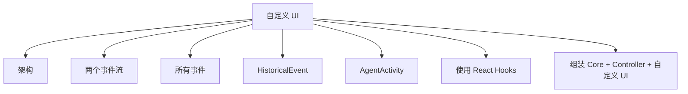

# 自定义 UI

- Source: [https://alibaba.github.io/page-agent/docs/advanced/custom-ui](https://alibaba.github.io/page-agent/docs/advanced/custom-ui)
- Section: 高级

## Outline Mermaid



## Outline

- 架构
- 两个事件流
- 所有事件
- HistoricalEvent
- AgentActivity
- 使用 React Hooks
- 组装 Core + Controller + 自定义 UI

## Content

PageAgent 的核心逻辑（PageAgentCore）和 UI 完全解耦，通过事件通讯。你可以用自己的 UI 替换内置 Panel。

## 架构

PageAgent 由三个独立模块组成，可自由组合：

- **PageAgentCore** - 核心 Agent 逻辑，不包含 UI
- **PageController** - DOM 操作和视觉反馈
- **UI (Panel)** - 用户界面，可替换为自定义实现

事件系统

## 两个事件流

PageAgentCore 提供两种不同性质的事件流，方便 UI 渲染：

|  | Historical Events | Activity Events |
| --- | --- | --- |
| 事件名 | `historychange` | `activity` |
| 持久性 | 持久化到 agent.history | 瞬态 |
| 传给 LLM | 是 | 否 |
| 用途 | 构成 Agent 记忆，显示历史步骤 | 实时 UI 反馈（如 loading 状态） |

## 所有事件

| Property | Type | Default | Description |
| --- | --- | --- | --- |
|  | `Event` | - | Agent 状态变化 (idle → running → completed/error) |
|  | `Event` | - | 历史事件更新，读取 agent.history 获取完整历史 |
|  | `CustomEvent<AgentActivity>` | - | 实时活动反馈：thinking, executing, executed, retrying, error |
|  | `Event` | - | Agent 被销毁 |

## HistoricalEvent

agent.history 数组中的事件类型：

```
type HistoricalEvent =
| { type: 'step'; stepIndex: number; reflection: AgentReflection; action: Action }
  | { type: 'observation'; content: string }
  | { type: 'user_takeover' }
  | { type: 'retry'; message: string; attempt: number; maxAttempts: number }
  | { type: 'error'; message: string }
```

## AgentActivity

activity 事件的 detail 类型：

```
type AgentActivity =
| { type: 'thinking' }
  | { type: 'executing'; tool: string; input: unknown }
  | { type: 'executed'; tool: string; input: unknown; output: string; duration: number }
  | { type: 'retrying'; attempt: number; maxAttempts: number }
  | { type: 'error'; message: string }
```

React 示例

## 使用 React Hooks

监听事件并更新 React 状态：

```javascript
function useAgent(agent: PageAgentCore) {
  const [status, setStatus] = useState(agent.status)
  const [history, setHistory] = useState(agent.history)
  const [activity, setActivity] = useState<AgentActivity | null>(null)

  useEffect(() => {
    const onStatus = () => setStatus(agent.status)
    const onHistory = () => setHistory([...agent.history])
    const onActivity = (e: Event) => setActivity((e as CustomEvent).detail)

    agent.addEventListener('statuschange', onStatus)
    agent.addEventListener('historychange', onHistory)
    agent.addEventListener('activity', onActivity)

    return () => {
      agent.removeEventListener('statuschange', onStatus)
      agent.removeEventListener('historychange', onHistory)
      agent.removeEventListener('activity', onActivity)
    }
  }, [agent])

  return { status, history, activity }
}
```

完整组装示例

## 组装 Core + Controller + 自定义 UI

参考内置 PageAgent 的实现方式，用自定义 UI 替换 Panel：

```javascript
import { PageAgentCore } from '@page-agent/core'
import { PageController } from '@page-agent/page-controller'
// 1. Create PageController
const pageController = new PageController({ enableMask: true })

// 2. Create PageAgentCore with controller
const agent = new PageAgentCore({
  pageController,
  baseURL: 'https://api.openai.com/v1',
  apiKey: 'your-api-key',
  model: 'gpt-5.2',
})

// 3. Mount your custom UI
const root = createRoot(document.getElementById('my-ui')!)
root.render(<MyAgentUI agent={agent} />)

// 4. Handle user input (optional)
agent.onAskUser = async (question) => window.prompt(question) || ''
// 5. Execute task
await agent.execute('Fill the form with test data')

// 6. Cleanup
agent.dispose()
```

## Internal Links

- [https://alibaba.github.io/page-agent/docs/advanced/custom-ui](https://alibaba.github.io/page-agent/docs/advanced/custom-ui)
