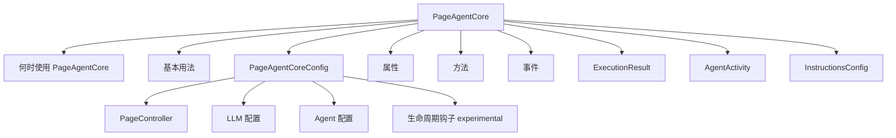

# PageAgentCore

- Source: [https://alibaba.github.io/page-agent/docs/advanced/page-agent-core](https://alibaba.github.io/page-agent/docs/advanced/page-agent-core)
- Section: 高级

## Outline Mermaid



## Outline

- 何时使用 PageAgentCore
- 基本用法
- PageAgentCoreConfig
  - PageController
  - LLM 配置
  - Agent 配置
  - 生命周期钩子 experimental
- 属性
- 方法
- 事件
- ExecutionResult
- AgentActivity
- InstructionsConfig

## Content

PageAgentCore 是不带 UI 的核心 Agent 类。用于需要自定义 UI 或无头运行的场景。

## 何时使用 PageAgentCore

- 需要自定义 UI 界面
- 在自动化测试中无头运行
- 在非浏览器环境运行（需自定义 PageController）
- 将 PageAgent 嵌入其他 Agent 系统

## 基本用法

```javascript
import { PageAgentCore } from '@page-agent/core'
import { PageController } from '@page-agent/page-controller'
const agent = new PageAgentCore({
  pageController: new PageController({ enableMask: true }),
  baseURL: 'https://api.openai.com/v1',
  apiKey: 'your-api-key',
  model: 'gpt-5.2',
})

// Listen to events for UI display
agent.addEventListener('statuschange', () => {
  console.log('Status:', agent.status)
})

agent.addEventListener('activity', (e) => {
  const activity = (e as CustomEvent).detail
console.log('Activity:', activity.type)
})

// Execute task
const result = await agent.execute('Fill in the form with test data')
```

配置

## PageAgentCoreConfig

PageAgentCoreConfig = AgentConfig & { pageController: PageController }。AgentConfig 包含以下配置项：

### PageController

| Property | Type | Default | Description |
| --- | --- | --- | --- |
|  | `PageController` | - | [PageController](https://alibaba.github.io/page-agent/docs/advanced/page-controller) 实例，用于 DOM 操作和元素交互。 |

### LLM 配置

| Property | Type | Default | Description |
| --- | --- | --- | --- |
|  | `string` | - | LLM API 的基础 URL（如 https://api.openai.com/v1） |
|  | `string` | - | 模型名称（如 gpt-5.2, anthropic/claude-4.5-haiku） |
|  | `string` | - | LLM AK |
|  | `number` | - | 模型温度参数，控制输出随机性 |
|  | `number` | `3` | API 调用失败时的最大重试次数 |
|  | `boolean` | `false` | 禁用命名 tool_choice，始终使用 "required" 字符串。适用于不支持 tool_choice 对象格式的 LLM 服务。 |
|  | `typeof fetch` | - | 自定义 fetch 函数，用于定制 headers、credentials、代理等 |

### Agent 配置

| Property | Type | Default | Description |
| --- | --- | --- | --- |
|  | `'en-US' | 'zh-CN'` | `'en-US'` | Agent 输出语言 |
|  | `number` | `40` | 每个任务的最大步骤数 |
|  | `Record<string, PageAgentTool | null>` | - | 自定义工具，可扩展或覆盖内置工具。设为 null 可移除工具。 |
|  | `InstructionsConfig` | - | 指导 Agent 行为的指令配置，见下方类型定义 |
|  | `(content: string) => string | Promise<string>` | - | 发送给 LLM 前转换页面内容，可用于数据脱敏 |
|  | `string` | - | 完全覆盖默认系统提示词。谨慎使用。 |
|  | `boolean` | `false` | 启用实验性 JavaScript 执行工具 |
|  | `boolean` | `false` | 从当前站点根目录获取 /llms.txt 并作为上下文提供给 LLM |

### 生命周期钩子 experimental

这些接口高度实验性，可能在未来版本中发生变化。

| Property | Type | Default | Description |
| --- | --- | --- | --- |
|  | `(agent, stepCount) => void | Promise<void>` | - | 每个步骤执行前调用 |
|  | `(agent, history) => void | Promise<void>` | - | 每个步骤执行后调用 |
|  | `(agent) => void | Promise<void>` | - | 任务开始前调用 |
|  | `(agent, result) => void | Promise<void>` | - | 任务结束后调用 |
|  | `(agent, reason?) => void` | - | Agent 销毁时调用 |

属性与方法

## 属性

| Property | Type | Default | Description |
| --- | --- | --- | --- |
|  | `'idle' | 'running' | 'completed' | 'error'` | - | 当前 Agent 执行状态 |
|  | `HistoricalEvent[]` | - | 历史事件数组，构成 Agent 的记忆 |
|  | `string` | - | 当前正在执行的任务 |
|  | `PageController` | - | PageController 实例，用于 DOM 操作 |
|  | `Map<string, PageAgentTool>` | - | 可用工具的 Map |
|  | `(question: string) => Promise<string>` | - | Agent 需要用户输入时的回调。未设置则禁用 ask_user 工具。 |

## 方法

| Method | Return Type | Default | Description |
| --- | --- | --- | --- |
|  | `Promise<ExecutionResult>` | - | 执行任务并返回结果。包含 success、data 和 history 字段。 |
|  | `void` | - | 停止当前任务。Agent 仍可复用。 |
|  | `void` | - | 销毁 Agent 并清理资源 |

## 事件

PageAgentCore 继承自 `EventTarget`，提供以下事件：

| Property | Type | Default | Description |
| --- | --- | --- | --- |
|  | `Event` | - | Agent 状态变化时触发 (idle → running → completed/error) |
|  | `Event` | - | 历史事件更新时触发（持久化事件，构成 Agent 记忆） |
|  | `CustomEvent<AgentActivity>` | - | 实时活动反馈（短暂状态，仅用于 UI）。类型包括：thinking, executing, executed, retrying, error |
|  | `Event` | - | Agent 被销毁时触发 |

类型定义

## ExecutionResult

```
interface ExecutionResult {
  success: boolean
data: string
history: HistoricalEvent[]
}
```

## AgentActivity

```
type AgentActivity =
| { type: 'thinking' }
  | { type: 'executing'; tool: string; input: unknown }
  | { type: 'executed'; tool: string; input: unknown; output: string; duration: number }
  | { type: 'retrying'; attempt: number; maxAttempts: number }
  | { type: 'error'; message: string }
```

## InstructionsConfig

```javascript
interface InstructionsConfig {
  /** Global system-level instructions, applied to all tasks */
system?: string
/**
   * Dynamic page-level instructions callback.
   * Called before each step to get instructions for the current page.
   */
getPageInstructions?: (url: string) => string | undefined
}
```

## Internal Links

- [https://alibaba.github.io/page-agent/docs/advanced/page-agent-core](https://alibaba.github.io/page-agent/docs/advanced/page-agent-core)
- [https://alibaba.github.io/page-agent/docs/advanced/page-controller](https://alibaba.github.io/page-agent/docs/advanced/page-controller)
