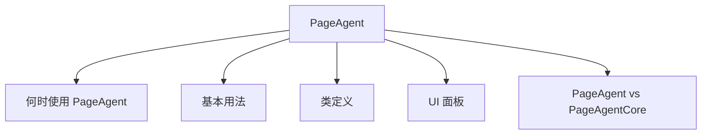

# PageAgent

- Source: [https://alibaba.github.io/page-agent/docs/advanced/page-agent](https://alibaba.github.io/page-agent/docs/advanced/page-agent)
- Section: 高级

## Outline Mermaid



## Outline

- 何时使用 PageAgent
- 基本用法
- 类定义
- UI 面板
- PageAgent vs PageAgentCore

## Content

PageAgent 是带有内置 UI 面板的完整 Agent 类。它继承自 PageAgentCore，并自动创建交互面板和 PageController。

## 何时使用 PageAgent

在大多数场景下，你应该使用 PageAgent。它提供了开箱即用的完整体验：

- 自动创建 PageController，处理 DOM 提取和元素操作
- 内置 UI 面板，显示任务进度、Agent 思考过程和操作结果
- 支持 ask_user 工具，Agent 可以向用户提问

## 基本用法

```javascript
import { PageAgent } from 'page-agent'
const agent = new PageAgent({
  // LLM Configuration (required)
baseURL: 'https://api.openai.com/v1',
  apiKey: 'your-api-key',
  model: 'gpt-5.2',
  
  // Optional settings
language: 'en-US',
})

// Execute a task
const result = await agent.execute('Click the login button')

console.log(result.success) // true or false
console.log(result.data)    // Task result description
console.log(result.history) // Full execution history
```

## 类定义

```
class PageAgent extends PageAgentCore {
  panel: Panel
pageController: PageController
constructor(config: PageAgentConfig)
}
```

PageAgent 继承自 [PageAgentCore](https://alibaba.github.io/page-agent/docs/advanced/page-agent-core)，所有核心方法和事件都可用。配置项合并了 [AgentConfig](https://alibaba.github.io/page-agent/docs/advanced/page-agent-core#configuration) 、 PanelConfig 和 [PageControllerConfig](https://alibaba.github.io/page-agent/docs/advanced/page-controller#configuration)。

## UI 面板

PageAgent 自动创建一个 Panel 实例。你可以通过 panel 属性控制 UI：

```
// Show/hide the panel
agent.panel.show()
agent.panel.hide()

// Expand/collapse history view
agent.panel.expand()
agent.panel.collapse()

// Reset panel state
agent.panel.reset()

// Dispose panel (called automatically when agent disposes)
agent.panel.dispose()
```

## PageAgent vs PageAgentCore

|  | PageAgent | PageAgentCore |
| --- | --- | --- |
| UI 面板 | ✓ | - |
| 自动创建 PageController | ✓ | - |
| Headless 模式 | - | ✓ |
| 适用场景 | 网页集成 | 自定义 UI / 无头 |

## Internal Links

- [https://alibaba.github.io/page-agent/docs/advanced/page-agent](https://alibaba.github.io/page-agent/docs/advanced/page-agent)
- [https://alibaba.github.io/page-agent/docs/advanced/page-agent-core](https://alibaba.github.io/page-agent/docs/advanced/page-agent-core)
- [https://alibaba.github.io/page-agent/docs/advanced/page-controller](https://alibaba.github.io/page-agent/docs/advanced/page-controller)
