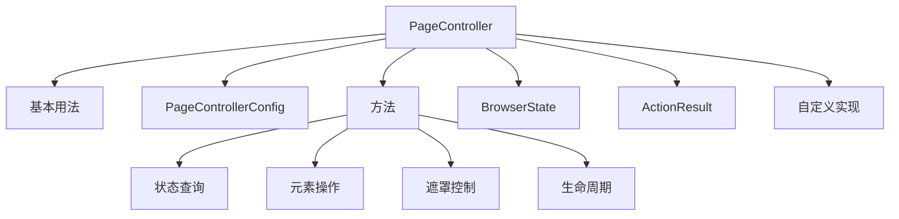

# PageController

- Source: [https://alibaba.github.io/page-agent/docs/advanced/page-controller](https://alibaba.github.io/page-agent/docs/advanced/page-controller)
- Section: 高级

## Outline Mermaid



## Outline

- 基本用法
- PageControllerConfig
- 方法
  - 状态查询
  - 元素操作
  - 遮罩控制
  - 生命周期
- BrowserState
- ActionResult
- 自定义实现

## Content

PageController 负责 DOM 提取和元素交互，独立于 LLM。它将页面状态结构化为 LLM 可消费的格式，并执行元素级操作。

## 基本用法

PageAgent 接受 PageController 配置项：

```javascript
import { PageAgent } from 'page-agent'
const agent = new PageAgent({
  baseURL: 'https://api.openai.com/v1',
  apiKey: 'your-api-key',
  model: 'gpt-5.2',

  // PageController options
enableMask: true,
  viewportExpansion: 0,
})
```

PageAgentCore 接受 PageController 实例：

```javascript
import { PageAgentCore } from '@page-agent/core'
import { PageController } from '@page-agent/page-controller'
const pageController = new PageController({
  enableMask: true,
  viewportExpansion: -1,  // extract full page
})

const agent = new PageAgentCore({
  pageController,
  baseURL: 'https://api.openai.com/v1',
  apiKey: 'your-api-key',
  model: 'gpt-5.2',
})
```

配置

## PageControllerConfig

| Property | Type | Default | Description |
| --- | --- | --- | --- |
|  | `boolean` | `false` | 启用视觉遮罩覆盖层，在自动化期间阻止用户操作页面。通过 PageAgent 创建时默认为 true。 |
|  | `number` | `0` | 向视口外扩展提取的像素数。设为 -1 表示提取整个页面。 |
|  | `(Element | (() => Element))[]` | - | 要排除的交互元素列表。支持元素引用或返回元素的函数（延迟求值）。 |
|  | `(Element | (() => Element))[]` | - | 要强制包含的交互元素列表。支持元素引用或返回元素的函数。 |
|  | `string[]` | - | 在 DOM 提取中包含的额外 HTML 属性。支持通配符 *（如 data-* 匹配所有 data- 开头的属性）。默认已包含常见属性如 role, aria-label 等。 |
|  | `boolean` | `false` | 在简化输出中保留语义标签（如 nav, main, header, footer, aside 等），即使它们不可交互。帮助 LLM 理解页面结构。 |

方法

## 方法

### 状态查询

| Method | Return Type | Default | Description |
| --- | --- | --- | --- |
|  | `Promise<BrowserState>` | - | 获取结构化的浏览器状态（URL、标题、简化 HTML 等），自动调用 updateTree() 刷新 DOM。这是 Agent 在每步使用的主要方法。 |
|  | `Promise<string>` | - | 刷新 DOM 树并返回简化 HTML。通常不需要手动调用 —— getBrowserState() 会自动调用。 |
|  | `Promise<string>` | - | 获取当前页面 URL。 |

### 元素操作

| Method | Return Type | Default | Description |
| --- | --- | --- | --- |
|  | `Promise<ActionResult>` | - | 按索引点击元素。索引来自简化 HTML 中的 [N] 标记。 |
|  | `Promise<ActionResult>` | - | 向输入框元素填入文本。 |
|  | `Promise<ActionResult>` | - | 在下拉框中选择选项。 |
|  | `Promise<ActionResult>` | - | 垂直滚动页面或指定元素。 |
|  | `Promise<ActionResult>` | - | 水平滚动页面或指定元素。 |

### 遮罩控制

| Method | Return Type | Default | Description |
| --- | --- | --- | --- |
|  | `Promise<void>` | - | 显示视觉遮罩。需要 enableMask: true。 |
|  | `Promise<void>` | - | 隐藏视觉遮罩。 |

### 生命周期

| Method | Return Type | Default | Description |
| --- | --- | --- | --- |
|  | `void` | - | 清理所有资源（DOM 高亮、遮罩等）。Agent 销毁时自动调用。 |

类型定义

## BrowserState

getBrowserState() 返回的结构化浏览器状态，直接用于构建 LLM prompt。

```
interface BrowserState {
  url: string
title: string
header: string // page info + scroll position
content: string // simplified HTML of interactive elements
footer: string // scroll hint
}
```

## ActionResult

```
interface ActionResult {
  success: boolean
message: string
}
```

## 自定义实现

在非浏览器环境（如 Puppeteer、Playwright），你可以实现自定义 PageController。需要实现 Agent 使用的核心方法：

```javascript
import { PageAgentCore } from '@page-agent/core'
import type { PageController } from '@page-agent/page-controller'
class PuppeteerPageController implements PageController {
  async getBrowserState() { /* ... */ }
  async clickElement(index: number) { /* ... */ }
  async inputText(index: number, text: string) { /* ... */ }
  async scroll(options: { down: boolean; numPages: number }) { /* ... */ }
  // ... other methods
}

const agent = new PageAgentCore({
  pageController: new PuppeteerPageController(),
  baseURL: 'https://api.openai.com/v1',
  apiKey: 'your-api-key',
  model: 'gpt-5.2',
})
```

## Internal Links

- [https://alibaba.github.io/page-agent/docs/advanced/page-controller](https://alibaba.github.io/page-agent/docs/advanced/page-controller)
