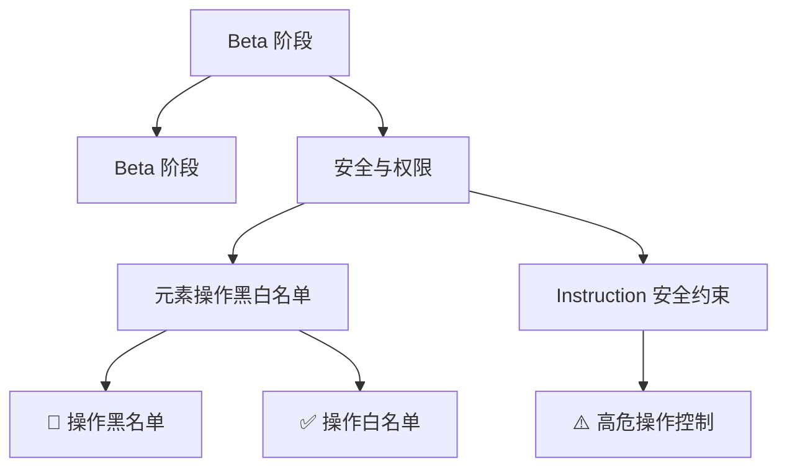

# Beta 阶段

- Source: [https://alibaba.github.io/page-agent/docs/advanced/security-permissions](https://alibaba.github.io/page-agent/docs/advanced/security-permissions)
- Section: 高级
- Nav Title: 🚧 安全与权限

## Outline Mermaid

## Outline

    - Beta 阶段
- 安全与权限
  - 元素操作黑白名单
    - 🚫 操作黑名单
    - ✅ 操作白名单
  - Instruction 安全约束
    - ⚠️ 高危操作控制

## Content

🚧

### Beta 阶段

当前功能未完成，接口可能随时变更。正式版本发布前请勿用于生产环境。

# 安全与权限

page-agent 提供多种安全机制，确保 AI 操作在可控范围内进行。

## 元素操作黑白名单

### 🚫 操作黑名单

禁止 AI 操作敏感元素，如删除按钮、支付按钮等。

### ✅ 操作白名单

明确定义 AI 可以操作的元素范围。

## Instruction 安全约束

### ⚠️ 高危操作控制

在 AI 指令中明确列举高危操作，通过两种策略进行控制：

完全禁止操作

对极高风险操作明确禁止执行

需用户确认操作

对中等风险操作要求用户明确同意

## Internal Links

- [https://alibaba.github.io/page-agent/docs/advanced/security-permissions](https://alibaba.github.io/page-agent/docs/advanced/security-permissions)
