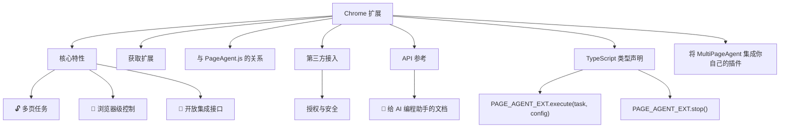

# Chrome 扩展

- Source: [https://alibaba.github.io/page-agent/docs/features/chrome-extension](https://alibaba.github.io/page-agent/docs/features/chrome-extension)
- Section: 功能特性

## Outline Mermaid



## Outline

- 核心特性
  - 🔓 多页任务
  - 🧭 浏览器级控制
  - 🔌 开放集成接口
- 获取扩展
- 与 PageAgent.js 的关系
- 第三方接入
  - 授权与安全
- API 参考
  - 🤖 给 AI 编程助手的文档
- TypeScript 类型声明
  - PAGE_AGENT_EXT.execute(task, config)
  - PAGE_AGENT_EXT.stop()
- 将 MultiPageAgent 集成你自己的插件

## Content

可选的 Chrome 扩展。PageAgent.js 继续负责页面内自动化；扩展 API 额外提供多页面任务、浏览器级控制，以及从浏览器外部发起任务的能力。

## 核心特性

### 🔓 多页任务

跨多个页面和标签页连续执行任务，不再受限于单页上下文。

### 🧭 浏览器级控制

支持跨标签导航、页面切换和更完整的浏览器自动化能力。

### 🔌 开放集成接口

用户主动授权后，页面 JS、本地 Agent 或云端 Agent 可通过扩展发起多页面任务。

## 获取扩展

从 Chrome 应用商店安装

GitHub Releases（更新版本）

## 与 PageAgent.js 的关系

PageAgent.js 本身即可在页面内完成自动化。Chrome 扩展是可选的能力扩展。

通过扩展，你可以执行多页面任务、控制浏览器，以及从浏览器外部（本地服务或云端服务）发起任务。

## 第三方接入

通过页面 JavaScript 调用 `window.PAGE_AGENT_EXT`，你的应用可以发起跨页面任务并控制浏览器行为。

### 授权与安全

扩展权限范围较广（例如页面访问、导航、多标签控制）。若被滥用，可能危害用户隐私。为此，调用能力由 Token 保护，用户必须主动将 Token 提供给其信任的应用。

```
// 1) 用户在扩展侧边栏获取 auth token
// 2) 仅在可信应用中设置该 token
// 3) token 匹配后，扩展会暴露 window.PAGE_AGENT_EXT
// ⚠️ 不要把 token 提供给不可信页面或脚本
localStorage.setItem('PageAgentExtUserAuthToken', '<从扩展中获取的-token>')
```

## API 参考

### 🤖 给 AI 编程助手的文档

如果你在使用 AI 编程助手（如 Cursor、GitHub Copilot），可以将以下文档链接提供给它，让它更好地理解和使用 Page Agent 扩展 API：

📄 API 文档

## TypeScript 类型声明

推荐把 `execute` 的类型声明加入你的项目，获得完整类型提示。

```javascript
import type {
	AgentActivity,
	AgentStatus,
	ExecutionResult,
	HistoricalEvent
} from '@page-agent/core'
interface ExecuteConfig {
	baseURL: string // LLM API endpoint
model: string // Model name
apiKey?: string // LLM AK
systemInstruction?: string // Global system-level instructions
includeInitialTab?: boolean
experimentalIncludeAllTabs?: boolean // Control all unpinned tabs in the window
onStatusChange?: (status: AgentStatus) => void
onActivity?: (activity: AgentActivity) => void
onHistoryUpdate?: (history: HistoricalEvent[]) => void
}

type Execute = (task: string, config: ExecuteConfig) => Promise<ExecutionResult>
declare global {
	interface Window {
		PAGE_AGENT_EXT_VERSION?: string
PAGE_AGENT_EXT?: {
			version: string
execute: Execute
stop: () => void
		}
	}
}
```

### PAGE_AGENT_EXT.execute(task, config)

```javascript
// 使用配置执行任务
const result = await window.PAGE_AGENT_EXT.execute(
	'在 GitHub 上搜索 "page-agent" 并打开第一个结果',
	{
		baseURL: 'https://api.openai.com/v1',
		apiKey: 'your-api-key',
		model: 'gpt-5.2',
		// includeInitialTab: false, // 设为 false 排除初始标签页
// experimentalIncludeAllTabs: true, // 控制窗口内所有非固定标签页
onStatusChange: status => console.log('状态变化:', status),
		onActivity: activity => console.log('活动:', activity),
		onHistoryUpdate: history => console.log('历史更新:', history)
	}
)

console.log(result) // 任务执行结果
```

### PAGE_AGENT_EXT.stop()

停止当前正在运行的任务。

```
// 停止当前任务
window.PAGE_AGENT_EXT.stop()
```

## 将 MultiPageAgent 集成你自己的插件

@TODO

建议先阅读扩展 API 文档，再参考 background entry implementation。[packages/extension/src/entrypoints/background.ts](https://github.com/alibaba/page-agent/blob/main/packages/extension/src/entrypoints/background.ts)

## Internal Links

- [https://alibaba.github.io/page-agent/docs/features/chrome-extension](https://alibaba.github.io/page-agent/docs/features/chrome-extension)
