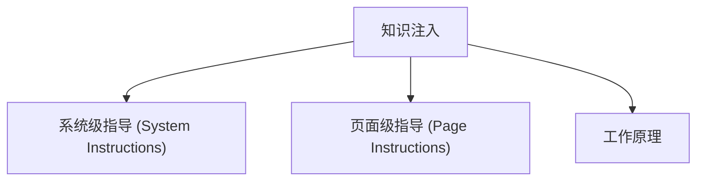

# 知识注入

- Source: [https://alibaba.github.io/page-agent/docs/features/custom-instructions](https://alibaba.github.io/page-agent/docs/features/custom-instructions)
- Section: 功能特性

## Outline Mermaid



## Outline

- 系统级指导 (System Instructions)
- 页面级指导 (Page Instructions)
- 工作原理

## Content

通过 instructions 配置，为 AI 注入系统级指导和页面级上下文，让它更好地理解你的业务场景。

## 系统级指导 (System Instructions)

全局提示词，应用于所有任务。定义 AI 的角色、工作风格和行为边界。

```javascript
const agent = new PageAgent({
  // ...other config
instructions: {
    system: `
You are a professional e-commerce assistant.

Guidelines:
- Always confirm before submitting orders
- Double-check prices and quantities
- Report errors immediately instead of retrying blindly
`
  }
})
```

## 页面级指导 (Page Instructions)

动态回调函数，在每个 step 执行前调用，根据当前页面 URL 返回特定提示词。适用于为不同页面提供针对性的操作引导。

```javascript
const agent = new PageAgent({
  // ...other config
instructions: {
    system: 'You are an order management assistant.',

    getPageInstructions: (url) => {
      if (url.includes('/checkout')) {
        return `
This is the checkout page.
- Verify shipping address before proceeding
- Check if any discounts are applied
- Confirm the total amount with the user
`
      }

      if (url.includes('/products')) {
        return `
This is the product listing page.
- Use filters to narrow down search results
- Check stock availability before adding to cart
`
      }

      return undefined // No special instructions for other pages
    }
  }
})
```

## 工作原理

在每个执行步骤之前，page-agent 会将 instructions 拼接到用户提示词中：

```html
<instructions>
<system_instructions>
You are a professional e-commerce assistant.
...
</system_instructions>
<page_instructions>
This is the checkout page.
...
</page_instructions>
</instructions>
<!-- followed by agent state, history, and browser state -->
```

- 如果 system 为空，则不输出 <system_instructions> 标签
- 如果 getPageInstructions 返回空值，则不输出 <page_instructions> 标签

## Internal Links

- [https://alibaba.github.io/page-agent/docs/features/custom-instructions](https://alibaba.github.io/page-agent/docs/features/custom-instructions)
