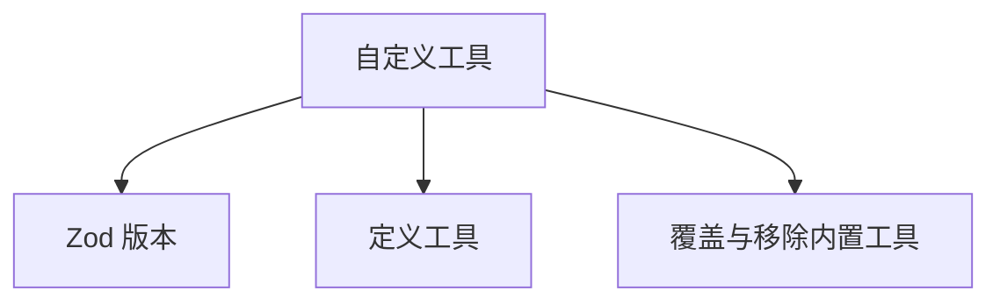

# 自定义工具

- Source: [https://alibaba.github.io/page-agent/docs/features/custom-tools](https://alibaba.github.io/page-agent/docs/features/custom-tools)
- Section: 功能特性

## Outline Mermaid



## Outline

- Zod 版本
- 定义工具
- 覆盖与移除内置工具

## Content

通过注册自定义工具，扩展 AI Agent 的能力边界。使用 Zod 定义输入接口，让 AI 安全调用你的业务逻辑。

## Zod 版本

Page Agent 使用 Zod 定义工具的输入 schema。支持 Zod 3 (>=3.25.0) 和 Zod 4，请从 zod/v4 子路径导入。不支持 Zod Mini。

```javascript
// Zod 3 (>=3.25.0) or Zod 4
import { z } from 'zod/v4'
```

## 定义工具

使用 tool() 辅助函数定义自定义工具，每个工具包含 description、inputSchema 和 execute 三个属性。

```javascript
import { z } from 'zod/v4'
import { PageAgent, tool } from 'page-agent'
const pageAgent = new PageAgent({
  customTools: {
  
	// 
add_to_cart: tool({
      description: 'Add a product to the shopping cart by its product ID.',
      inputSchema: z.object({
        productId: z.string(),
        quantity: z.number().min(1).default(1),
      }),
      execute: async function (input) {
        await fetch('/api/cart', {
          method: 'POST',
          body: JSON.stringify(input),
        })
        return `Added ${input.quantity}x ${input.productId} to cart.`
      },
    }),

	// 
search_knowledge_base: tool({
      description: 'Search the internal knowledge base and return relevant articles.',
      inputSchema: z.object({
        query: z.string(),
        limit: z.number().max(10).default(3),
      }),
      execute: async function (input) {
        const res = await fetch(
          `/api/kb?q=${encodeURIComponent(input.query)}&limit=${input.limit}`
        )
        const articles = await res.json()
        return JSON.stringify(articles)
      },
    }),
  },
})
```

## 覆盖与移除内置工具

使用相同的名称可以覆盖内置工具的行为，设置为 null 则完全移除该工具。

```javascript
const pageAgent = new PageAgent({
  customTools: {
    scroll: null, // remove scroll tool
execute_javascript: null, // remove script execution
  },
})
```

## Internal Links

- [https://alibaba.github.io/page-agent/docs/features/custom-tools](https://alibaba.github.io/page-agent/docs/features/custom-tools)
