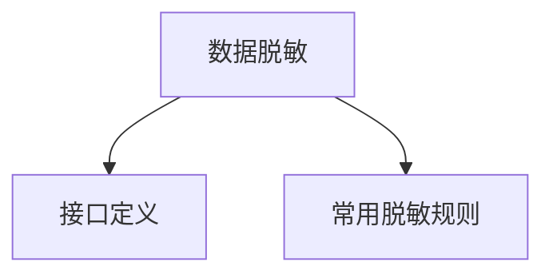

# 数据脱敏

- Source: [https://alibaba.github.io/page-agent/docs/features/data-masking](https://alibaba.github.io/page-agent/docs/features/data-masking)
- Section: 功能特性

## Outline Mermaid



## Outline

- 接口定义
- 常用脱敏规则

## Content

使用 transformPageContent 钩子在页面内容发送给 LLM 之前进行处理，可用于检查清洗效果、修改页面信息、隐藏敏感数据等。

## 接口定义

```javascript
interface PageAgentConfig {
  /**
   * Transform page content before sending to LLM.
   * Called after DOM extraction and simplification.
   */
transformPageContent?: (content: string) => Promise<string> | string
}
```

## 常用脱敏规则

以下示例展示了如何脱敏常见的敏感信息：

```javascript
const agent = new PageAgent({
  transformPageContent: async (content) => {
    // China phone number (11 digits starting with 1)
content = content.replace(/\b(1[3-9]\d)(\d{4})(\d{4})\b/g, '$1****$3')

    // Email address
content = content.replace(
      /\b([a-zA-Z0-9._%+-])[^@]*(@[a-zA-Z0-9.-]+\.[a-zA-Z]{2,})\b/g,
      '$1***$2'
    )

    // China ID card number (18 digits)
content = content.replace(
      /\b(\d{6})(19|20\d{2})(0[1-9]|1[0-2])(0[1-9]|[12]\d|3[01])(\d{3}[\dXx])\b/g,
      '$1********$5'
    )

    // Bank card number (16-19 digits)
content = content.replace(/\b(\d{4})\d{8,11}(\d{4})\b/g, '$1********$2')

    return content
  }
})
```

## Internal Links

- [https://alibaba.github.io/page-agent/docs/features/data-masking](https://alibaba.github.io/page-agent/docs/features/data-masking)
