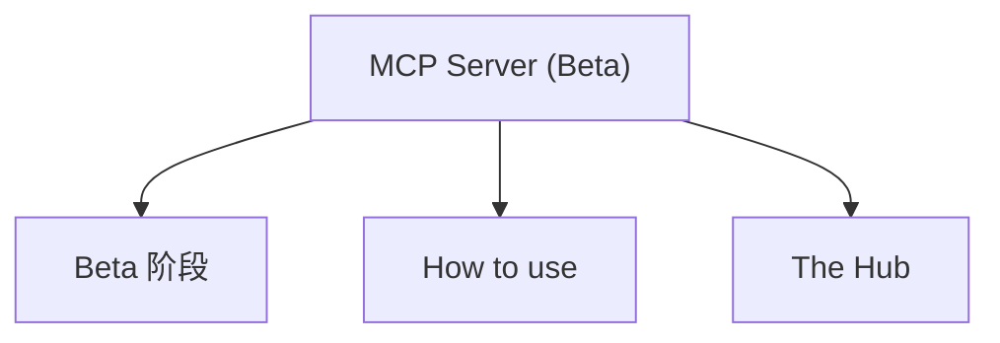

# MCP Server (Beta)

- Source: [https://alibaba.github.io/page-agent/docs/features/mcp-server](https://alibaba.github.io/page-agent/docs/features/mcp-server)
- Section: 功能特性

## Outline Mermaid



## Outline

  - Beta 阶段
- How to use
- The Hub

## Content

🚧

### Beta 阶段

当前功能未完成，接口可能随时变更。正式版本发布前请勿用于生产环境。

Use the MCP server to let your local agent send natural-language browser tasks to Page Agent Ext.

## How to use

1. Install Page Agent Ext in Chrome.
2. Add the MCP server to your local agent client.
3. Start the client and approve the Hub connection in the browser when prompted.
4. Ask your agent to do something in the browser. The client will call execute_task for you.

```json
{
  "mcpServers": {
    "page-agent": {
      "command": "npx",
      "args": ["-y", "@page-agent/mcp"],
      "env": {
        "LLM_BASE_URL": "https://api.openai.com/v1",
        "LLM_API_KEY": "sk-xxx",
        "LLM_MODEL_NAME": "gpt-5.2"
      }
    }
  }
}
```

## The Hub

The Hub is the control center for communication between Page Agent Ext and external callers.

When the MCP server starts, it opens a local launcher page. The launcher asks the extension to open the Hub tab, and the Hub receives tasks from your local agent. MCP uses this path, but the Hub itself is the extension's general external communication entry point.

## Internal Links

- [https://alibaba.github.io/page-agent/docs/features/mcp-server](https://alibaba.github.io/page-agent/docs/features/mcp-server)
