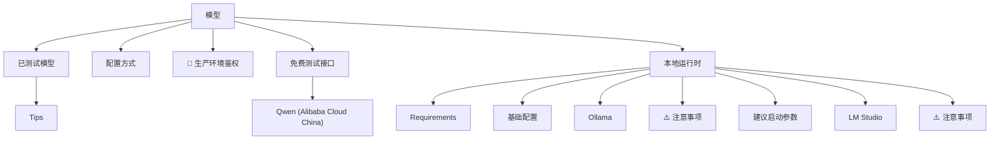

# 模型

- Source: [https://alibaba.github.io/page-agent/docs/features/models](https://alibaba.github.io/page-agent/docs/features/models)
- Section: 功能特性

## Outline Mermaid



## Outline

- 已测试模型
  - Tips
- 配置方式
- 🔐 生产环境鉴权
- 免费测试接口
  - Qwen (Alibaba Cloud China)
- 本地运行时
  - Requirements
  - 基础配置
  - Ollama
  - ⚠️ 注意事项
  - 建议启动参数
  - LM Studio
  - ⚠️ 注意事项

## Content

当前支持符合 OpenAI 接口规范且支持 tool call 的模型,包括公有云服务和私有部署方案。

## 已测试模型

Qwen

qwen3.6-plus

qwen3.5-plus

⭐

qwen3.5-flash

⭐

qwen3-coder-next

qwen-3-max

qwen-3-plus

OpenAI

gpt-5.4

gpt-5.2

gpt-5.1

⭐

gpt-5

gpt-5-mini

gpt-4.1

gpt-4.1-mini

DeepSeek

deepseek-3.2

⭐

Google

gemini-3-pro

gemini-3-flash

⭐

gemini-2.5

Anthropic

claude-opus-4.6

claude-opus-4.5

claude-sonnet-4.5

claude-haiku-4.5

⭐

claude-sonnet-3.5

MiniMax

MiniMax-M2.7

MiniMax-M2.7-highspeed

MiniMax-M2.5

MiniMax-M2.5-highspeed

xAI

grok-4.1-fast

grok-4

grok-code-fast

MoonshotAI

kimi-k2.5

Z.AI

glm-5

glm-4.7

### Tips

- ⭐ 推荐使用 ToolCall 能力强的轻量级模型
- ToolCall 能力较弱的模型可能返回错误的格式，常见错误能够自动恢复，建议设置较高的 temperature
- 小模型或者无法适应复杂 Tool 定义的模型，通常效果不佳

## 配置方式

```javascript
// OpenAI-compatible services (e.g., Alibaba Bailian)
const pageAgent = new PageAgent({
  baseURL: 'https://dashscope.aliyuncs.com/compatible-mode/v1',
  apiKey: 'your-api-key',
  model: 'qwen3.5-plus'
});
```

## 🔐 生产环境鉴权

如果你只是将它用作个人助手，可以直接连接你的 LLM 服务。

如果你计划将它集成到你的 Web 应用中，建议搭建一个后端代理来转发 LLM 请求，并使用 `customFetch` 携带 Cookie 或其他鉴权信息：

```javascript
const agent = new PageAgent({
  baseURL: '/api/llm-proxy',
  model: 'gpt-5.1',
  customFetch: (url, init) =>
fetch(url, { ...init, credentials: 'include' }),
});
```

⚠️ 永远不要把真实的 LLM API Key 提交到前端代码中

## 免费测试接口

以下免费测试接口仅供 PageAgent.js 和 PageAgent Extension 的技术评估和测试使用。

⚠️ 仅供技术评估和研发用途，禁止用于生产环境。数据通过中国大陆服务器处理。请勿输入任何个人身份信息或敏感数据。使用即表示您同意 [使用条款](https://github.com/alibaba/page-agent/blob/main/docs/terms-and-privacy.md#2-testing-api-and-demo-disclaimer--terms-of-use)

### Qwen (Alibaba Cloud China)

通过阿里云函数计算（中国大陆）转发至百炼 Qwen 模型 · [使用条款](https://github.com/alibaba/page-agent/blob/main/docs/terms-and-privacy.md#2-testing-api-and-demo-disclaimer--terms-of-use)

```
# qwen3.5-plus / qwen3.5-flash
LLM_BASE_URL="https://page-ag-testing-ohftxirgbn.cn-shanghai.fcapp.run"
LLM_MODEL_NAME="qwen3.5-plus"
```

## 本地运行时

通过 Ollama、LM Studio 等本地 OpenAI-compatible 运行时接入 PageAgent，实现离线或局域网部署。

### Requirements

- 务必打开 CORS，否则浏览器无法直接请求本地 LLM 服务。
- 将 context length 或 content length 至少设置为 8000。普通页面常常需要 15k token 左右，默认 4k 很容易被截断。
- 需要支持 tool_call 的模型。
- 小于 10B 参数的模型通常效果不佳。

### 基础配置

```javascript
// Local OpenAI-compatible runtime - no apiKey needed
const pageAgent = new PageAgent({
  baseURL: 'http://localhost:11434/v1',
  model: 'qwen3:14b'
});

// Or connect to LM Studio
const lmStudioAgent = new PageAgent({
  baseURL: 'http://127.0.0.1:1234/v1',
  model: 'qwen/qwen3.5-27b'
});
```

### Ollama

已在 Ollama 0.15 + qwen3:14b (RTX3090 24GB) 上测试通过。

```
LLM_BASE_URL="http://localhost:11434/v1"
LLM_MODEL_NAME="qwen3:14b"
```

### ⚠️ 注意事项

如果浏览器侧请求失败，优先检查 Ollama 是否已按上面的要求开启 CORS。

### 建议启动参数

启动 Ollama 时建议同时放大上下文窗口并开启跨域访问。

macOS / Linux

```
OLLAMA_CONTEXT_LENGTH=64000 OLLAMA_HOST=0.0.0.0:11434 OLLAMA_ORIGINS="*" ollama serve
```

Windows (PowerShell)

```
$env:OLLAMA_CONTEXT_LENGTH=64000; $env:OLLAMA_HOST="0.0.0.0:11434"; $env:OLLAMA_ORIGINS="*"; ollama serve
```

### LM Studio

```
LLM_BASE_URL="http://127.0.0.1:1234/v1"
LLM_MODEL_NAME="qwen/qwen3.5-27b"
```

### ⚠️ 注意事项

- Agent 必须启用 disableNamedToolChoice，否则 tool_choice 参数会报错。

## Internal Links

- [https://alibaba.github.io/page-agent/docs/features/models](https://alibaba.github.io/page-agent/docs/features/models)
