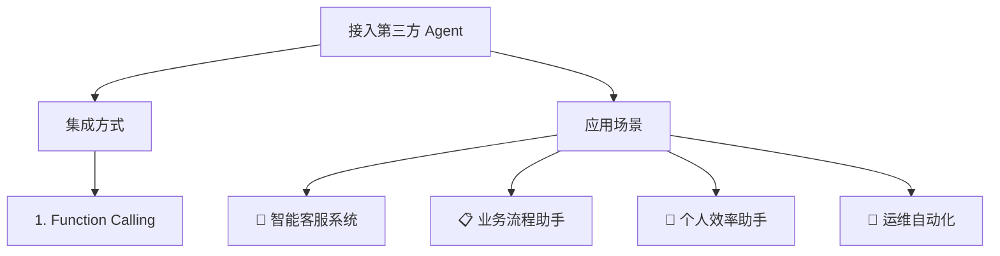

# 接入第三方 Agent

- Source: [https://alibaba.github.io/page-agent/docs/features/third-party-agent](https://alibaba.github.io/page-agent/docs/features/third-party-agent)
- Section: 功能特性

## Outline Mermaid



## Outline

- 集成方式
  - 1. Function Calling
- 应用场景
    - 🤖 智能客服系统
    - 📋 业务流程助手
    - 🎯 个人效率助手
    - 🔧 运维自动化

## Content

将 pageAgent 作为工具接入你的答疑助手或 Agent 系统，成为你 Agent 的眼和手。

## 集成方式

### 1. Function Calling

```javascript
// 定义工具
const pageAgentTool = {
  name: "page_agent",
  description: "执行网页操作",
  parameters: {
    type: "object",
    properties: {
      instruction: { type: "string", description: "操作指令" }
    },
    required: ["instruction"]
  },
  execute: async (params) => {
    const result = await pageAgent.execute(params.instruction)
    return { success: result.success, message: result.data }
  }
}

// 注册到你的 agent 中
```

## 应用场景

#### 🤖 智能客服系统

客服机器人帮用户直接操作系统，如"帮我提交工单"

#### 📋 业务流程助手

引导新员工完成复杂流程，如"完成客户入职"

#### 🎯 个人效率助手

跨网站帮你完成任务，如"预订会议室"

#### 🔧 运维自动化

通过自然语言操作管理后台，如"重启服务器"

## Internal Links

- [https://alibaba.github.io/page-agent/docs/features/third-party-agent](https://alibaba.github.io/page-agent/docs/features/third-party-agent)
