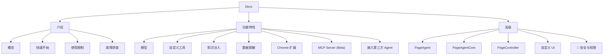

# page-agent

- Start URL: [https://alibaba.github.io/page-agent/docs/introduction/overview](https://alibaba.github.io/page-agent/docs/introduction/overview)
- Docs Root: [https://alibaba.github.io/page-agent/docs/](https://alibaba.github.io/page-agent/docs/)
- Total Pages: 16
- Summary: [summary.md](summary.md)

## Navigation Mermaid

## Navigation Tree

- 介绍
  - [概览](https://alibaba.github.io/page-agent/docs/introduction/overview)
  - [快速开始](https://alibaba.github.io/page-agent/docs/introduction/quick-start)
  - [使用限制](https://alibaba.github.io/page-agent/docs/introduction/limitations)
  - [故障排查](https://alibaba.github.io/page-agent/docs/introduction/troubleshooting)
- 功能特性
  - [模型](https://alibaba.github.io/page-agent/docs/features/models)
  - [自定义工具](https://alibaba.github.io/page-agent/docs/features/custom-tools)
  - [知识注入](https://alibaba.github.io/page-agent/docs/features/custom-instructions)
  - [数据脱敏](https://alibaba.github.io/page-agent/docs/features/data-masking)
  - [Chrome 扩展](https://alibaba.github.io/page-agent/docs/features/chrome-extension)
  - [MCP Server (Beta)](https://alibaba.github.io/page-agent/docs/features/mcp-server)
  - [接入第三方 Agent](https://alibaba.github.io/page-agent/docs/features/third-party-agent)
- 高级
  - [PageAgent](https://alibaba.github.io/page-agent/docs/advanced/page-agent)
  - [PageAgentCore](https://alibaba.github.io/page-agent/docs/advanced/page-agent-core)
  - [PageController](https://alibaba.github.io/page-agent/docs/advanced/page-controller)
  - [自定义 UI](https://alibaba.github.io/page-agent/docs/advanced/custom-ui)
  - [🚧 安全与权限](https://alibaba.github.io/page-agent/docs/advanced/security-permissions)

## Pages

- [使用限制](introduction/limitations.md)
- [Quick Start](introduction/quick-start.md)
- [Troubleshooting](introduction/troubleshooting.md)
- [Overview](introduction/overview.md)
- [Chrome 扩展](features/chrome-extension.md)
- [MCP Server (Beta)](features/mcp-server.md)
- [接入第三方 Agent](features/third-party-agent.md)
- [数据脱敏](features/data-masking.md)
- [模型](features/models.md)
- [知识注入](features/custom-instructions.md)
- [自定义工具](features/custom-tools.md)
- [PageAgent](advanced/page-agent.md)
- [PageAgentCore](advanced/page-agent-core.md)
- [PageController](advanced/page-controller.md)
- [自定义 UI](advanced/custom-ui.md)
- [Beta 阶段](advanced/security-permissions.md)
