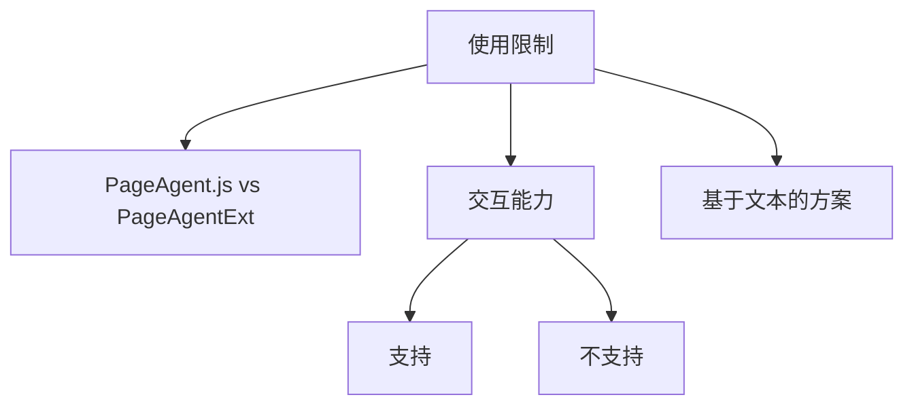

# 使用限制

- Source: [https://alibaba.github.io/page-agent/docs/introduction/limitations](https://alibaba.github.io/page-agent/docs/introduction/limitations)
- Section: 介绍

## Outline Mermaid

## Outline

- PageAgent.js vs PageAgentExt
- 交互能力
  - 支持
  - 不支持
- 基于文本的方案

## Content

Page Agent 基于 DOM 理解网页并执行操作。这决定了它的能力边界。

## PageAgent.js vs PageAgentExt

PageAgent.js 是核心库，运行在页面内。PageAgentExt 是可选的浏览器扩展，提供额外的浏览器级控制能力。

|  | PageAgent.js | PageAgentExt [了解更多](https://alibaba.github.io/page-agent/docs/features/chrome-extension) |
| --- | --- | --- |
| 接入方式 | 网站开发者主动集成 | 用户安装浏览器扩展 |
| 可操作范围 | 当前页面（为 SPA 设计） | 任意网页、多标签页 |
| 额外能力 | — | 新建/切换/关闭标签页 |

## 交互能力

### 支持

- ✓点击、文本输入、选择
- ✓页面滚动（垂直 / 水平）
- ✓表单提交、焦点切换
- ✓同源 iframe（仅单层）
- ✓执行 JavaScript（可选）

### 不支持

- ✗悬停、拖拽、右键菜单
- ✗键盘快捷键
- ✗坐标定位操作
- ✗嵌套 iframe、跨域 iframe
- ✗绘图操作
- ✗Monaco、CodeMirror 等需要通过 JS 实例控制的编辑器

## 基于文本的方案

Page Agent 不使用多模态模型，不截图，没有视觉能力。仅通过 DOM 结构理解页面。

图片、Canvas、WebGL、SVG 等视觉内容无法被识别。页面的语义化程度和可访问性直接影响 AI 的理解准确性。

反常识的交互逻辑、纯视觉的操作提示、快速出现消失的元素等都会降低自动化成功率。语义化的 HTML 和良好的可访问性会显著提升效果。

## Internal Links

- [https://alibaba.github.io/page-agent/docs/introduction/limitations](https://alibaba.github.io/page-agent/docs/introduction/limitations)
- [https://alibaba.github.io/page-agent/docs/features/chrome-extension](https://alibaba.github.io/page-agent/docs/features/chrome-extension)
