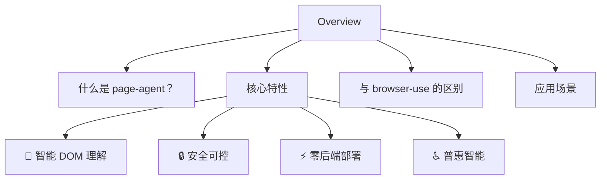

# Overview

- Source: [https://alibaba.github.io/page-agent/docs/introduction/overview](https://alibaba.github.io/page-agent/docs/introduction/overview)
- Section: 介绍
- Nav Title: 概览

## Outline Mermaid

## Outline

- 什么是 page-agent？
- 核心特性
  - 🧠 智能 DOM 理解
  - 🔒 安全可控
  - ⚡ 零后端部署
  - ♿ 普惠智能
- 与 browser-use 的区别
- 应用场景

## Content

page-agent 是一个完全基于 Web 技术的 GUI Agent，简单几步，让你的网站拥有 AI 操作员。

## 什么是 page-agent？

page-agent 是一个页面内嵌式 GUI Agent。与传统的浏览器自动化工具不同，page-agent 面向网站开发者，而非爬虫或Agent客户端开发者；将 Agent 集成到你的网站中，让用户可以通过自然语言与页面进行交互。

## 核心特性

### 🧠 智能 DOM 理解

基于 DOM 分析，高强度脱水。无需视觉识别，纯文本实现精准操作。

### 🔒 安全可控

支持操作黑白名单、数据脱敏保护。注入自定义知识库，让 AI 按你的规则工作。

### ⚡ 零后端部署

CDN 或 NPM 引入，自定义 LLM 接入点。

### ♿ 普惠智能

为复杂 B端系统、管理后台提供自然语言入口。让每个用户都能轻松上手。

## 与 browser-use 的区别

|  | page-agent | browser-use |
| --- | --- | --- |
| 部署方式 | 页面内嵌组件 | 外部工具 |
| 操作范围 | 当前页面 | 整个浏览器 |
| 目标用户 | 网站开发者 | 爬虫/Agent 开发者 |
| 使用场景 | 用户体验增强 | 自动化任务 |

## 应用场景

- 1
- 2
- 3
- 4

## Internal Links

- [https://alibaba.github.io/page-agent/docs/introduction/overview](https://alibaba.github.io/page-agent/docs/introduction/overview)
