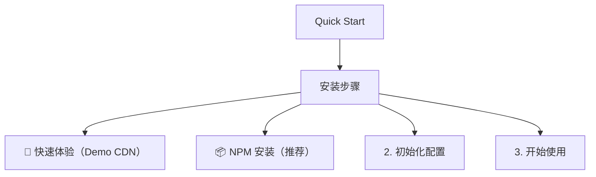

# Quick Start

- Source: [https://alibaba.github.io/page-agent/docs/introduction/quick-start](https://alibaba.github.io/page-agent/docs/introduction/quick-start)
- Section: 介绍
- Nav Title: 快速开始

## Outline Mermaid



## Outline

- 安装步骤
  - 🚀 快速体验（Demo CDN）
  - 📦 NPM 安装（推荐）
  - 2. 初始化配置
  - 3. 开始使用

## Content

几分钟内完成 page-agent 的集成。

## 安装步骤

### 🚀 快速体验（Demo CDN）

⚠️ 该 Demo CDN 使用了免费的测试 LLM API，使用即表示您同意其[使用条款](https://github.com/alibaba/page-agent/blob/main/docs/terms-and-privacy.md#2-testing-api-and-demo-disclaimer--terms-of-use)

```html
<script src="DEMO_CDN_URL" crossorigin="true"></script>
```

| 镜像 | URL |
| --- | --- |
| 全球 | https://cdn.jsdelivr.net/npm/page-agent@1.7.1/dist/iife/page-agent.demo.js |
| 中国 | https://registry.npmmirror.com/page-agent/1.7.1/files/dist/iife/page-agent.demo.js |

### 📦 NPM 安装（推荐）

```javascript
// npm install page-agent
import { PageAgent } from 'page-agent'
```

### 2. 初始化配置

```javascript
const agent = new PageAgent({
  model: 'qwen3.5-plus',
  baseURL: 'https://dashscope.aliyuncs.com/compatible-mode/v1',
  apiKey: 'YOUR_API_KEY',
  language: 'zh-CN'
})
```

### 3. 开始使用

```javascript
// 程序化执行自然语言指令
await agent.execute('点击提交按钮，然后填写用户名为张三');

// 或者
// 显示对话框让用户输入指令
agent.panel.show()
```

## Internal Links

- [https://alibaba.github.io/page-agent/docs/introduction/quick-start](https://alibaba.github.io/page-agent/docs/introduction/quick-start)
