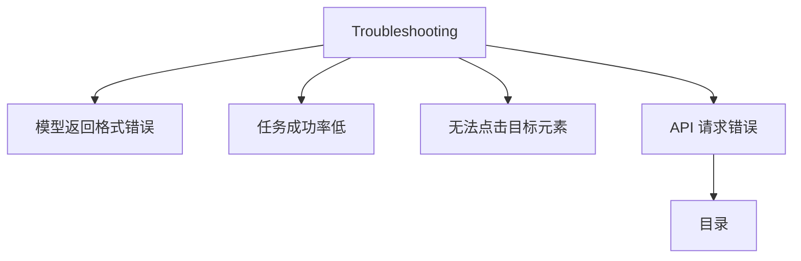

# Troubleshooting

- Source: [https://alibaba.github.io/page-agent/docs/introduction/troubleshooting](https://alibaba.github.io/page-agent/docs/introduction/troubleshooting)
- Section: 介绍
- Nav Title: 故障排查

## Outline Mermaid



## Outline

- 模型返回格式错误
- 任务成功率低
- 无法点击目标元素
- API 请求错误
    - 目录

## Content

## 模型返回格式错误

症状

模型返回了格式错误的 tool call、纯文本或非预期的 JSON，而非结构化的操作指令。

1. **确认模型是否支持**
2. **检查代理/网关的参数转发**
3. **寻求社区帮助**

## 任务成功率低

症状

Agent 似乎理解了任务，但频繁执行失败或产生不正确的结果。

按以下顺序逐步排查，从最简单的情况开始：

1. **先从简单指令开始**
2. **尝试最强模型**
3. **优化指令质量**
4. **提供充足的上下文**
5. **检查 HTML 清洗结果**

## 无法点击目标元素

症状

Agent 反复重试，但始终点击在错误的元素上，或无法定位到正确的目标元素。

1. **了解现实局限**
2. **检查目标元素类型**
3. **检查清洗后的 HTML**
4. **注入 accessibility 增强**
5. **开发专用 Tool**

## API 请求错误

症状

调用 LLM API 时出现 HTTP 400 Bad Request 或类似的参数错误。

一些 LLM 供应商使用了与 OpenAI 不完全兼容的参数格式，导致请求参数校验失败。

解决方案：使用 customFetch

通过 customFetch 配置拦截请求，在发送前调整参数格式以适配目标供应商的要求。

```javascript
const agent = new PageAgent({
  // ...
customFetch: async (url, init) => {
    // Adapt parameters for your provider
const body = JSON.parse(init.body)
    delete body.tool_choice
const bodyStr = JSON.stringify(body)

    return fetch(url, { ...init, body: bodyStr })
  },
})
```

参见 [PageAgentCore API](https://alibaba.github.io/page-agent/docs/advanced/page-agent-core) 了解 customFetch 的完整用法。

## Internal Links

- [https://alibaba.github.io/page-agent/docs/introduction/troubleshooting](https://alibaba.github.io/page-agent/docs/introduction/troubleshooting)
- [https://alibaba.github.io/page-agent/docs/features/models](https://alibaba.github.io/page-agent/docs/features/models)
- [https://alibaba.github.io/page-agent/docs/features/custom-tools](https://alibaba.github.io/page-agent/docs/features/custom-tools)
- [https://alibaba.github.io/page-agent/docs/advanced/page-agent-core](https://alibaba.github.io/page-agent/docs/advanced/page-agent-core)
